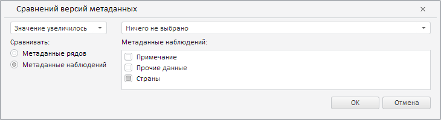

# RevisionMetadataComparisonWizard.CurrentState

RevisionMetadataComparisonWizard.CurrentState
-

**

# RevisionMetadataComparisonWizard.CurrentState

## Синтаксис

CurrentState: Object

## Описание

Свойство CurrentState** определяет текущие настройки мастера для валидации данных путём сравнения версий метаданных.

## Комментарии

Значение свойства устанавливается с помощью метода setCurrentState, а возвращается с помощью метода getCurrentState. Из JSON значение задать нельзя.

## Пример

Для выполнения примера необходимо наличие на html-странице экземпляра класса [RevisionMetadataComparisonWizard](RevisionMetadataComparisonWizard.htm) с наименованием «revisionMetadataComparisonWizard» (см. «[Конструктор RevisionMetadataComparisonWizard](Constructor_RevisionMetadataComparisonWizard.htm)»), а также наличие в источнике данных рабочей книги атрибута наблюдений с идентификатором «COUNTRIES» и ключом 10. Определим новые настройки для мастера валидации данных путём сравнения версий метаданных:

// Определим новые настройки мастера
var state = {
    // Укажем, что значение увеличилось
    "compType": PP.TS.ValidationRevisionComparisonType.Increase,
    // Сравниваем метаданные наблюдений
    "calcType": PP.TS.MsCalculationType.Pointwise,
    "attributes": {
        "its": {
            "it": [{
                    id: "COUNTRIES",
                    k: 10 // Ключ атрибута
                }
            ]
        }
    }
};
// Применим данные настройки
revisionMetadataComparisonWizard.setCurrentState(state);

В результате выполнения примера в рассматриваемом мастере ревизия данных больше не указывается. Также было установлено, что значение увеличилось и сравнение производится по метаданным атрибута наблюдения «Страны»:

См. также:

[RevisionMetadataComparisonWizard](RevisionMetadataComparisonWizard.htm)

		Справочная
		 система на версию 10.9
		 от 18/08/2025,
		 © ООО «ФОРСАЙТ»,
