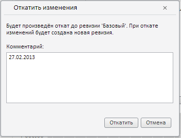

# RevisionsPanel.Source

RevisionsPanel.Source
-

# RevisionsPanel.Source

## Синтаксис

Source: PP.TS.[WbkDocument](../WbkDocument/WbkDocument.htm);

## Описание

Свойство Source возвращает рабочую книгу, данные которой отображаются в компоненте.

## Пример

Для выполнения примера предполагается наличие на странице компонента [WorkbookBox](../../../Components/TimeSeries/WorkbookBox/WorkbookBox.htm) с наименованием «workbookBox» (см. «[Пример создания компонента WorkbookBox](../../../Components/TimeSeries/WorkbookBox/Component_WorkbookBox.htm)»), базы данных временных рядов с ключом 112, также необходимо в обработчике события открытия документа добавить следующий код:

	var sourceButt = new PP.Ui.Button({
		ParentNode: document.body, //Родительский узел DOM
		Content: "Источник", //Подпись
		Click: PP.Delegate(onClickSource)
		});
	function onClickSource()
	{
     //Получаем ключ БДВР
     var rubKey = wbk.getActiveSheet().getRub().meta.obInst.obDesc.k;
     //Получаем панель свойств рабочей книги
     var wbkPB = workbookBox.getPropertyBarView();
     //Получаем массив элементов, расположенных на панели статистик
     var panels = wbkPB._selfNavItems;
     var revisionsPanel = null;
     var i;
     //Выбираем панель ревизий из массива элементов, расположенных на панели статистик
     for (i = 0; i < panels.length; i++)
     {
      if (panels[i]._GroupName == PP.TS.Ui.PropertyGroups.RubricatorRevisions && panels[i].getTag() == rubKey)
      {
       revisionsPanel = wbkPB._selfNavItems[i];
       break;
      }
     }
     //В зависимости от наличия установленного источника данных устанавливаем или убираем источник данных
     if(revisionsPanel.getSource())
     {
      revisionsPanel.setSource(null);
      sourceButt.setContent("Источник не установлен")
     }
     else
     {
      revisionsPanel.setSource(wbk);
      sourceButt.setContent("Источник установлен")
     }
    }

После выполнения примера на html-странице будет размещен компонент [WorkbookBox](../../../Components/TimeSeries/WorkbookBox/WorkbookBox.htm) и кнопка с наименованием «Источник». Для выполнения примера также необходимо на [панели свойств рабочей книги](../WbkPropertyBarView/WbkPropertyBarView.htm) выбрать вкладку «Данные». Перейти на панель, название которой соответствует названию базы данных временных рядов, затем выбрать любую из доступных ревизий и нажать на кнопку «Источник». Надпись на кнопке «Источник установлен» будет означать, что в данный момент для панели ревизий базы данных временных рядов установлен источник данных. При выборе доступной ревизии и нажатии на кнопку на панели «Откатить», на экран будет выведено окно, имеющее следующий вид:

Это свидетельствует о том, что для панели ревизий базы данных временных рядов установлен источник данных.

Если надпись на кнопке «Источник не установлен», то при выборе доступной ревизии и нажатии на кнопку панели «Откатить» на экран ничего не будет выведено. И это будет свидетельствовать о том, что для панели ревизий базы данных временных рядов не установлен источник данных.

См. также:

[RevisionsPanel](RevisionsPanel.htm)

		Справочная
		 система на версию 10.9
		 от 18/08/2025,
		 © ООО «ФОРСАЙТ»,
