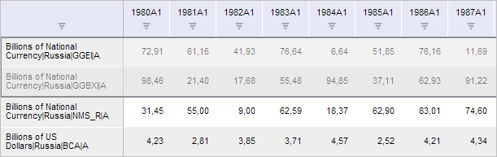
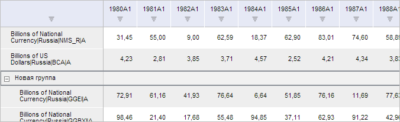
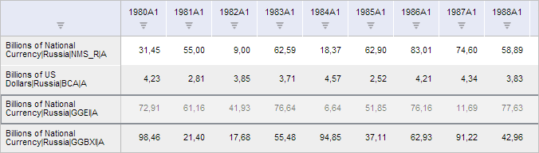

# SeriesAbstractCatView.getGroupSeriesButton

SeriesAbstractCatView.getGroupSeriesButton
-

**

# SeriesAbstractCatView.getGroupSeriesButton

## Синтаксис

getGroupSeriesButton();

## Описание

Метод getGroupSeriesButton**
 возвращает кнопку «Группировать» ленты инструментов рабочей книги.

## Комментарии

Метод возвращает объект типа [PP.Ui.RibbonButton](dhtmlRibbon.chm::/Components/RibbonButton/RibbonButton.htm).

## Пример

Для выполнения примера необходимо наличие на html-странице компонента
 [WorkbookBox](../../../Components/TimeSeries/WorkbookBox/WorkbookBox.htm)
 с наименованием «workbookBox» (см. «[Пример
 создания компонента WorkbookBox](../../../Components/TimeSeries/WorkbookBox/Component_WorkbookBox.htm)») и с загруженной таблицей в области
 данных рабочей книги. В таблице необходимо выделить первые две
 строки, соответствующие временным рядам:

Сгруппируем выбранные временные ряды:

// Получим ленту инструментов рабочей книги
var ribbon = workbookBox.getRibbonView();
// Получим вкладку «Данные» ленты инструментов
var dataCategory = ribbon.getDataCategory();
// Отобразим её и откроем
dataCategory.setIsHiddenActive(true)
ribbon.refreshAll();
// Получим кнопку «Группировать»
var groupSeriesButton = dataCategory.getGroupSeriesButton();
// Cымитируем нажатие данной кнопки
groupSeriesButton.Click.fire(groupSeriesButton);

В результате выполнения примера выбранные временные ряды были сгруппированы.
 После раскрытия новой группы таблица будет иметь следующий вид:

Теперь разобъём созданную группу временных рядов:

// Получим кнопку «Разгруппировать»
var ungroupSeriesButton = dataCategory.getUngroupSeriesButton();
// Cымитируем нажатие данной кнопки
ungroupSeriesButton.Click.fire(ungroupSeriesButton);
После выполнения примера рассматриваемая группа временных рядов была
 разгруппирована:

См. также:

[SeriesAbstractCatView](SeriesAbstractCatView.htm)

		Справочная
		 система на версию 10.9
		 от 18/08/2025,
		 © ООО «ФОРСАЙТ»,
