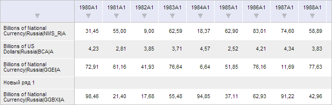
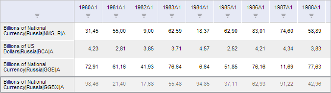

# SeriesAbstractCatView.getInsertButton

SeriesAbstractCatView.getInsertButton
-

**

# SeriesAbstractCatView.getInsertButton

## Синтаксис

getInsertButton();

## Описание

Метод getInsertButton**
 возвращает кнопку «Добавить ряд» ленты инструментов рабочей книги.

## Комментарии

Метод возвращает объект типа [PP.Ui.RibbonButton](dhtmlRibbon.chm::/Components/RibbonButton/RibbonButton.htm).

## Пример

Для выполнения примера необходимо наличие на html-странице компонента
 [WorkbookBox](../../../Components/TimeSeries/WorkbookBox/WorkbookBox.htm)
 с наименованием «workbookBox» (см. «[Пример
 создания компонента WorkbookBox](../../../Components/TimeSeries/WorkbookBox/Component_WorkbookBox.htm)») и с загруженной таблицей в области
 данных рабочей книги. Добавим новый временной ряд:

// Получим ленту инструментов рабочей книги
var ribbon = workbookBox.getRibbonView();
// Получим вкладку «Данные» ленты инструментов
var dataCategory = ribbon.getDataCategory();
// Отобразим её и откроем
dataCategory.setIsHiddenActive(true)
ribbon.refreshAll();
// Получим кнопку «Добавить ряд»
var insertButton = dataCategory.getInsertButton();
// Cымитируем нажатие данной кнопки
insertButton.Click.fire(insertButton);

В результате выполнения примера был отображён диалог «Добавить ряд».
 Выберем в нём уровень календаря «Годы» и нажмём на кнопку «OK». После
 этого в таблице будет добавлен новый ряд:

Выделим вручную добавленный ряд. Затем программно удалим его:

// Получим кнопку «Удалить»
var removeButton = dataCategory.getRemoveButton();
// Cымитируем нажатие данной кнопки
removeButton.Click.fire(removeButton);
В результате выполнения примера было отображено окно, запрашивающее
 подтверждение на удаление выбранных рядов. Нажмём на кнопку «Да». После
 этого рассматриваемый временной ряд будет удалён из таблицы:

См. также:

[SeriesAbstractCatView](SeriesAbstractCatView.htm)

		Справочная
		 система на версию 10.9
		 от 18/08/2025,
		 © ООО «ФОРСАЙТ»,
