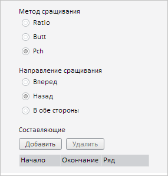

# SpliceMethodWizard.CurrentState

SpliceMethodWizard.CurrentState
-

**

# SpliceMethodWizard.CurrentState

## Синтаксис

CurrentState: Object

## Описание

Свойство CurrentState**
 содержит текущие настройки мастера для сращивания временных рядов.

## Комментарии

Значение свойства устанавливается с помощью метода setCurrentState,
 а возвращается - с помощью метода getCurrentState.
 Из JSON значение установить нельзя.

Свойство содержит JSON-объект со следующими полями: dependentSeries
 - массив зависимых рядов, direction - направление сращивания рядов (значение
 задаётся с помощью элемента перечисления [PP.TS.Ui.TsSpliceDirection](../../../Enums/TsSpliceDirection.htm)),
 selectionTimeRanges - массив выделенных временных диапазонов, splice -
 настройки сращивания рядов (объект содержит свойства direction и type),
 type - метод сращивания рядов (значение задаётся с помощью перечисления
 [PP.TS.Ui.TsSpliceType](../../../Enums/TsSpliceType.htm)).

## Пример

Для выполнения примера необходимо наличие на html-странице компонента
 [WorkbookBox](../../../Components/TimeSeries/WorkbookBox/WorkbookBox.htm)
 с наименованием «workbookBox» (см. «[Пример
 создания компонента WorkbookBox](../../../Components/TimeSeries/WorkbookBox/Component_WorkbookBox.htm)»). Установим метод и направление сращивания
 временных рядов в соответствующем мастере на вкладке «Параметры» боковой
 панели рабочей книги:

// Получим панель свойств рабочей книги
var propertyBar = workbookBox.getPropertyBarView();
// Получим панель параметров
var parametersPanel = propertyBar.getParametersPanel();
// Отобразим данную панель
parametersPanel.show();
// Развернём панель
parametersPanel.expand();
// Получим мастер настройки сращивания временных рядов
var spliceMethodWizard = parametersPanel._SpliceMethodWizard;
// Отобразим данный мастер
spliceMethodWizard.show();
// Получим настройки мастера
var state = spliceMethodWizard.getCurrentState();
// Установим метод совмещения рядов с темпами прироста
state.type = PP.TS.Ui.TsSpliceType.Pch;
// Установим тип направления совмещения рядов «Назад»
state.direction = PP.TS.Ui.TsSpliceDirection.Backward;
// Установим новые настройки мастера
spliceMethodWizard.setCurrentState(state);

В результате выполнения примера в мастере настройки совмещения временных
 рядов был установлен метод их сращивания с темпами прироста в обратном
 направлении:

См. также:

[SpliceMethodWizard](SpliceMethodWizard.htm)

		Справочная
		 система на версию 10.9
		 от 18/08/2025,
		 © ООО «ФОРСАЙТ»,
