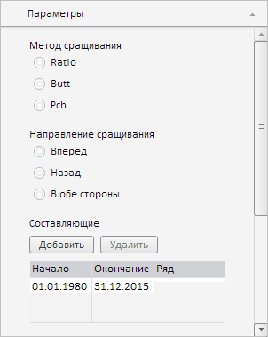

# SpliceTabSheetDataSource.addRow

SpliceTabSheetDataSource.addRow
-

# SpliceTabSheetDataSource.addRow

## Синтаксис

addRow();

## Описание

Метод addRow добавляет новую
 строку в таблицу сращиваемых временных рядов.

## Пример

Для выполнения примера необходимо наличие на html-странице компонента
 [WorkbookBox](../../../Components/TimeSeries/WorkbookBox/WorkbookBox.htm)
 с наименованием «workbookBox» (см. «[Пример
 создания компонента WorkbookBox](../../../Components/TimeSeries/WorkbookBox/Component_WorkbookBox.htm)»). Добавим в таблице сращиваемых временных
 рядов три строки, а затем удалим из неё две последние строки:

// Получим панель свойств рабочей книги
var propertyBar = workbookBox.getPropertyBarView();
// Получим панель параметров
var parametersPanel = propertyBar.getParametersPanel();
// Отобразим данную панель
parametersPanel.show();
// Развернём панель
parametersPanel.expand();
// Получим и отобразим мастер настройки сращивания временных рядов
var spliceMethodWizard = parametersPanel._SpliceMethodWizard;
// Отобразим данный мастер
spliceMethodWizard.show();
// Получим источник данных таблицы для указанного мастера
var tabSheetDS = spliceMethodWizard._DataSource;
// Добавим в таблицу три строки
tabSheetDS.addRow();
tabSheetDS.addRow();
tabSheetDS.addRow();
console.log("Количество строк в таблице после добавления: " + (tabSheetDS.getRowsCount() - 1));
// Удалим вторую и третью строку
tabSheetDS.deleteRow(1, 2);
console.log("Количество строк в таблице после удаления: " + (tabSheetDS.getRowsCount() - 1));
// Загрузим в таблицу данные
tabSheetDS.loadMeasures();
// Обновим таблицу
spliceMethodWizard._TabSheet.update();

В результате выполнения примера в таблице сращиваемых временных рядов
 из добавленных трёх строк останется только одна:

В консоли браузера будет выведено количество строк в данной таблице
 после добавления и удаления из неё строк:

Количество строк в таблице после добавления: 3

Количество строк в таблице после удаления: 1

См. также:

[SpliceTabSheetDataSource](SpliceTabSheetDataSource.htm)

		Справочная
		 система на версию 10.9
		 от 18/08/2025,
		 © ООО «ФОРСАЙТ»,
