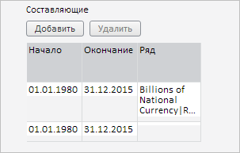

# SpliceTabSheetDataSource.getData

SpliceTabSheetDataSource.getData
-

# SpliceTabSheetDataSource.getData

## Синтаксис

getData();

## Описание

Метод getData возвращает информацию о таблице сращиваемых временных рядов.

## Комментарии

Метод возвращает JSON-объект с следующими полями: dependentSeries - массив объектов с ключами указанных в таблице временных рядов, selectionTimeRanges - массив выбранных временных диапазонов с указанием времени их начала (свойство endDate) и окончания (свойство endDate).

## Пример

Для выполнения примера необходимо наличие на html-странице компонента [WorkbookBox](../../../Components/TimeSeries/WorkbookBox/WorkbookBox.htm) с наименованием «workbookBox» (см. «[Пример создания компонента WorkbookBox](../../../Components/TimeSeries/WorkbookBox/Component_WorkbookBox.htm)»). Добавим в таблицу сращиваемых временных рядов две строки, одну из которых свяжем с первым временным рядом:

// Получим панель свойств рабочей книги
var propertyBar = workbookBox.getPropertyBarView();
// Получим панель параметров
var parametersPanel = propertyBar.getParametersPanel();
// Отобразим данную панель
parametersPanel.show();
// Развернём панель
parametersPanel.expand();
// Получим мастер настройки сращивания временных рядов
var spliceMethodWizard = parametersPanel._SpliceMethodWizard;
// Отобразим данный мастер
spliceMethodWizard.show();
// Получим источник данных таблицы для указанного мастера
var tabSheetDS = spliceMethodWizard._DataSource;
// Добавим в таблицу две строки
tabSheetDS.addRow();
tabSheetDS.addRow();
// Получим первый ряд и зададим его для первой строки таблицы, не являющейся заголовком
var serie = workbookBox.getSource().getSeries()[0];
tabSheetDS._Cells[5].CellData.FT = serie.n;
tabSheetDS._Cells[5].CellData.V = serie.k;
// Обновим таблицу
spliceMethodWizard._TabSheet.update();
// Получим информацию о строках, привязанных к временным рядам
var fillRowsCounter = 0; // Счётчик строк с указанным временным рядом
var rowsCounter = 0; // Счётчик всех строк таблицы
while (fillRowsCounter < tabSheetDS.getFillRowsCount()) {
    if (tabSheetDS.getIsRowFilled(rowsCounter)) {
        var data = tabSheetDS.getData();
        console.log("Ключ указанного временного ряда: " + data.dependentSeries[fillRowsCounter].k);
        fillRowsCounter++;
    }
    rowsCounter++;
};

В результате выполнения примера в таблицу были добавлены две строки, для первой из них был задан первый временной ряд:

В консоли браузера были выведены ключи всех временных рядов, указанных в таблице сращивания:

Ключ указанного временного ряда: 2

См. также:

[SpliceTabSheetDataSource](SpliceTabSheetDataSource.htm)

		Справочная
		 система на версию 10.9
		 от 18/08/2025,
		 © ООО «ФОРСАЙТ»,
