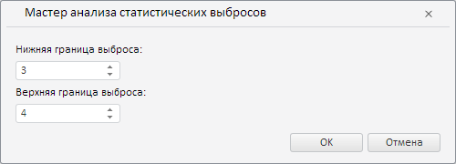

# StatisticalOutliersWizard.CurrentState

StatisticalOutliersWizard.CurrentState
-

**

# StatisticalOutliersWizard.CurrentState

## Синтаксис

CurrentState: Object

## Описание

Свойство CurrentState**
 определяет текущие настройки мастера для валидации путём анализа статистических
 выбросов данных временных рядов.

## Комментарии

Значение свойства устанавливается с помощью метода setCurrentState,
 а возвращается с помощью метода getCurrentState.
 Из JSON значение задать нельзя.

## Пример

Для выполнения примера необходимо наличие на html-странице экземпляра
 класса [StatisticalOutliersWizard](StatisticalOutliersWizard.htm)
 с наименованием «statisticalOutliersWizard» (см. «[Конструктор
 StatisticalOutliersWizard](Constructor_StatisticalOutliersWizard.htm)»). Определим новые настройки для мастера
 валидации путём анализа статистических выбросов данных временных рядов:

// Определим настройки мастера
var state = {
    "lowerPercentile": 3, // Нижняя граница выброса
    "upperPercentile": 4 // Верхняя граница выброса
};
// Применим данные настройки
statisticalOutliersWizard.setCurrentState(state);

В результате выполнения примера в рассматриваемом мастере была
 установлена нижняя граница выбора, равная 3, и верхняя граница выбора,
 равная 4:

См. также:

[StatisticalOutliersWizard](StatisticalOutliersWizard.htm)

		Справочная
		 система на версию 10.9
		 от 18/08/2025,
		 © ООО «ФОРСАЙТ»,
