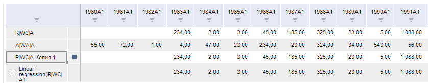

# TSService.copySeries

TSService.copySeries
-

# TSService.copySeries

## Синтаксис

copySeries (wbk, series, callback);

## Параметры

wbk. Задает [рабочую книгу](../Workbook/Workbook.htm);

series. Задает массив рядов;

callback. Задает обработчик окончания выполнения операции.

## Описание

Метод copySeries копирует ряды.

## Пример

Для выполнения примера предполагается наличие на странице компонента [WorkbookBox](../../../Components/TimeSeries/WorkbookBox/WorkbookBox.htm) с наименованием «workbookBox» (см. «[Пример создания компонента WorkbookBox](../../../Components/TimeSeries/WorkbookBox/Component_WorkbookBox.htm)»), также необходимо в обработчике события открытия документа добавить следующий код:

	var copySerieButt = new PP.Ui.Button({
		ParentNode: document.body, //Родительский узел DOM
		Content: "Copy series", //Подпись
		Click: PP.Delegate(onClickCopySerie)
		});

	function onClickCopySerie()
	{
		var source = workbookBox.getSource();//Возвращаем экземпляр класса PP.TS.WbkDocument
		//Получаем первый ряд
		var serie = source.getSeries()[0];
		//Копируем первый ряд
		tsService.copySeries(source, serie, function ()
		{
			//Обновляем компонент workbookBox
			workbookBox.refreshAll();
		});
	}

После выполнения примера на html-странице будет размещен компонент [WorkbookBox](../../../Components/TimeSeries/WorkbookBox/WorkbookBox.htm) и кнопка с наименованием «Copy series». При нажатии на кнопку будет скопирован первый ряд рабочей книги.

См. также:

[TSService](TSService.htm)

		Справочная
		 система на версию 10.9
		 от 18/08/2025,
		 © ООО «ФОРСАЙТ»,
