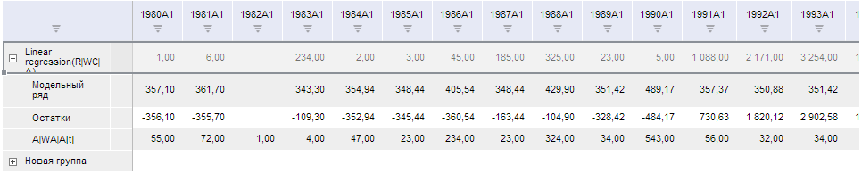

# TSService.GroupSeries

TSService.GroupSeries
-

# TSService.GroupSeries

## Синтаксис

GroupSeries (wbk, series, callback);

## Параметры

wbk. Задает значение [рабочей книги](../Workbook/Workbook.htm);

series. Задает массив индексов рядов в таблице;

callback. Задает обработчик окончания выполнения операции.

## Описание

Метод GroupSeries группирует ряды рабочей книги.

## Пример

Для выполнения примера предполагается наличие на странице компонента [WorkbookBox](../../../Components/TimeSeries/WorkbookBox/WorkbookBox.htm) с наименованием «workbookBox» (см. «[Пример создания компонента WorkbookBox](../../../Components/TimeSeries/WorkbookBox/Component_WorkbookBox.htm)»), также необходимо чтобы в рабочей книге первый и второй ряд были не групповыми, а в обработчике события открытия документа необходимо добавить следующий код:

var groupSeriesButt = new PP.Ui.Button({
	ParentNode: document.body, //родительский узел DOM
	Content: "Группировать ряд", //подпись
	Click: PP.Delegate(onClickGroupSeries)
});
function onClickGroupSeries()
	{
		var wbk = args.Workbook;
		//Получаем ряды
		var series = wbk.getSeries();
		//Выбираем ряды для группировки
		var toOneGroup = [series[0], series[1]];
		//Группируем ряды рабочей книги
		tsService.GroupSeries(wbk, toOneGroup, PP.Delegate(onGroupSeries, this));
		// Обработчик события окончания выполнения метода GroupSeries
		function onGroupSeries(sender, args){
		//Обновляем, чтобы увидеть сгруппированные записи
		workbookBox.refreshAll();
	}
}

После выполнения примера на html-странице будет размещена кнопка с наименованием «Группировать ряд», при нажатии на которую первые два ряда рабочей книги будут сгруппированы в новую группу:

См. также:

[TSService](TSService.htm)

		Справочная
		 система на версию 10.9
		 от 18/08/2025,
		 © ООО «ФОРСАЙТ»,
