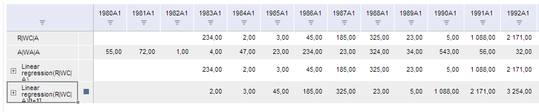

# TSService.addCalculatedRow

TSService.addCalculatedRow
-

# TSService.addCalculatedRow

## Синтаксис

addCalculatedRow (wbk, metaData, callback);

## Параметры

wbk. Задает значение [рабочей книги](../Workbook/Workbook.htm);

metaData. Задает метаданные книги с информацией о добавляемых вычислимых рядах;

callback. Задает обработчик окончания выполнения операции.

## Описание

Метод addCalculatedRow добавляет вычисляемые ряды.

## Пример

Для выполнения примера предполагается наличие на странице компонента [WorkbookBox](../../../Components/TimeSeries/WorkbookBox/WorkbookBox.htm) с наименованием «workbookBox» (см. «[Пример создания компонента WorkbookBox](../../../Components/TimeSeries/WorkbookBox/Component_WorkbookBox.htm)»), также необходимо в обработчике события открытия документа добавить следующий код:

	metabase.EndRequest.add(function addCalcRow(){
	var source = workbookBox.getSource();//возвращаем экземпляр класса PP.TS.Workbook
	//Получаем выбранные ряды
	var selectedRows = source.getSelectedSeries();
	var metaData = {"formulaType": "TransformLead", "index": 2, "selectedRows" : selectedRows, "serieFlags": 24}
	var typeUpdateData = new Array();
	typeUpdateData.push("AddCalculateSeries");
	typeUpdateData.push("Chart");
	typeUpdateData.push("Map");
	var args = new PP.Mb.Ui.PropertyChangedEventArgs(
	{
		PropertyName: "Formulas",
		TypeUpdateData: typeUpdateData,
		Metadata: metaData
	});
	//Добавляем вычисляемые ряды
	tsService.addCalculatedRow(source, args, function()
	{
		metabase.EndRequest.remove(addCalcRow);
		workbookBox.refreshAll();
		});
	});

После выполнения примера на html-странице будет размещен компонент [WorkbookBox](../../../Components/TimeSeries/WorkbookBox/WorkbookBox.htm) и в таблице рабочей книги будет добавлен новый вычисляемый ряд.

См. также:

[TSService](TSService.htm)

		Справочная
		 система на версию 10.9
		 от 18/08/2025,
		 © ООО «ФОРСАЙТ»,
