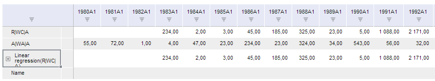

# TSService.addWbkSeriesByFactorKeys

TSService.addWbkSeriesByFactorKeys
-

# TSService.addWbkSeriesByFactorKeys

## Синтаксис

addWbkSeriesByFactorKeys (wbk, hieOdId, factorKeys, factorNames, callback);

## Параметры

wbk. Задает значение [рабочей книги](../Workbook/Workbook.htm);

hieOdId. Задает моникёр иерархии рядов;

factorKeys. Задает массив ключей факторов;

factorNames. Задает массив имён рядов;

callback. Задает обработчик окончания выполнения операции.

## Описание

Метод addWbkSeriesByFactorKeys добавляет ряды в рабочую книгу по ключам факторов.

## Пример

Для выполнения примера предполагается наличие на странице компонента [WorkbookBox](../../../Components/TimeSeries/WorkbookBox/WorkbookBox.htm) с наименованием «workbookBox» (см. «[Пример создания компонента WorkbookBox](../../../Components/TimeSeries/WorkbookBox/Component_WorkbookBox.htm)»), также необходимо в обработчике события открытия документа добавить следующий код:

	var source = workbookBox.getSource();//Возвращаем экземпляр класса PP.TS.WbkDocument
	var hieOdId = "";
	var factorKeys = [1];
	var factorNames = ['Name'];
	//Добавляем ряды в рабочую книгу по ключам факторов
	tsService.addWbkSeriesByFactorKeys(wbk, hieOdId, factorKeys, factorNames, PP.Delegate(onFactorKeys, this));
	// Обработчик события окончания выполнения метода addWbkSeriesByFactorKeys
	function onFactorKeys(sender, args){
		//Обновляем компонент workbookBox
		workbookBox.refreshAll();
	}

После выполнения примера в таблице рабочей книги будет добавлен новый ряд с наименованием «Name»:

См. также:

[TSService](TSService.htm)

		Справочная
		 система на версию 10.9
		 от 18/08/2025,
		 © ООО «ФОРСАЙТ»,
