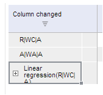

# TSService.changeColumns

TSService.changeColumns
-

# TSService.changeColumns

## Синтаксис

changeColumns (wbk, columns, callback);

## Параметры

wbk. Задает значение [рабочей книги](../Workbook/Workbook.htm);

columns. Задает столбцы;

callback. Задает обработчик завершения операции.

## Описание

Метод changeColumns изменяет столбцы рабочей книги.

## Пример

Для выполнения примера предполагается наличие на странице компонента [WorkbookBox](../../../Components/TimeSeries/WorkbookBox/WorkbookBox.htm) с наименованием «workbookBox» (см. «[Пример создания компонента WorkbookBox](../../../Components/TimeSeries/WorkbookBox/Component_WorkbookBox.htm)»), также необходимо в обработчике события открытия документа добавить следующий код:

	var changeColumnsButt = new PP.Ui.Button({
		ParentNode: document.body, //родительский узел DOM
		Content: "Изменить столбец", //подпись
		Click: PP.Delegate(onClickChangeColumnsButt)
		});

	function onClickChangeColumnsButt()
	{
		var source = workbookBox.getSource();//Возвращаем экземпляр класса PP.TS.WbkDocument
		var columns = wbk.getWbkMetadata().columns;
		//Изменяем надпись на заголовке колонки
		columns.its.it[0].customTitle = 'Column changed';
		//Изменяем столбцы рабочей книги
		tsService.changeColumns(wbk, columns, PP.Delegate(onColumnsChanged, this));
		// Обработчик обработчик завершения функции changeColumns
		function onColumnsChanged(sender, args){
			//Обновляем компонент workbookBox
			workbookBox.refreshAll();
		}
	}

После выполнения примера на html-странице будет размещена кнопка с наименованием «Изменить столбец». При нажатии на кнопку, заголовок колонки в таблице рабочей книги будет изменен на «Column changed»:

См. также:

[TSService](TSService.htm)

		Справочная
		 система на версию 10.9
		 от 18/08/2025,
		 © ООО «ФОРСАЙТ»,
