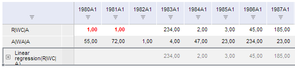

# TSService.editData

TSService.editData
-

# TSService.editData

## Синтаксис

editData (report, updateSeriesIndex, callback);

## Параметры

report. Задает рабочую книгу, экземпляр класса [Workbook](../Workbook/Workbook.htm);

updateSeriesIndex. Задает массив индексов рядов в ячейках, в которых изменены данные;

callback. Задает обработчик окончания выполнения операции.

## Описание

Метод editData посылает запрос на изменение данных в ячейках таблицы рабочей книги.

## Пример

Для выполнения примера предполагается наличие на странице компонента [WorkbookBox](../../../Components/TimeSeries/WorkbookBox/WorkbookBox.htm) с наименованием «workbookBox» (см. «[Пример создания компонента WorkbookBox](../../../Components/TimeSeries/WorkbookBox/Component_WorkbookBox.htm)»), также необходимо чтобы панель свойств была открыта. А в обработчике события открытия документа добавить следующий код:

var editDataButt = new PP.Ui.Button({
	ParentNode: document.body, //Родительский узел DOM
	Content: "Изменить данные", //Подпись
	Click: PP.Delegate(onClickEditData)
});
var columnIndex = 0;
var res = { c: [] };
function onClickEditData(){
	//Пока не изменим все ячейки в ряде, изменяем значения ячеек
	while(wbk.getActiveSheet().getWbkMetadata().cellsTable["@columnCount"] > columnIndex)
		{
			//Формируем объект с данными в ячейках
			res.c.push({
			"@column": columnIndex,
			"@row": 0,
			"@v": 1,
			"@dt": 3
		});
	columnIndex++;
	//Устанавливаем свойство, в котором хранятся данные для изменения в ячейках в рабочей книге
	wbk.setTableChangedData(res);
	//Посылаем запрос на изменение данных в ячейках таблицы рабочей книги.
	tsService.editData(wbk, [0,2], PP.Delegate(function()
		{
			//Обновляем отображение рабочей книги
				workbookBox.refreshAll();
		}));
		break;
		}
	}

После выполнения примера на html-странице будет размещена кнопка с наименованием «Изменить данные». Для выполнения примера необходимо, чтобы панель свойств рабочей книги была открыта. При нажатии на кнопку будет записано значение 1,00 в первую ячейку первого ряда, и при каждом последующем нажатии - в следующую.

См. также:

[TSService](TSService.htm)

		Справочная
		 система на версию 10.9
		 от 18/08/2025,
		 © ООО «ФОРСАЙТ»,
