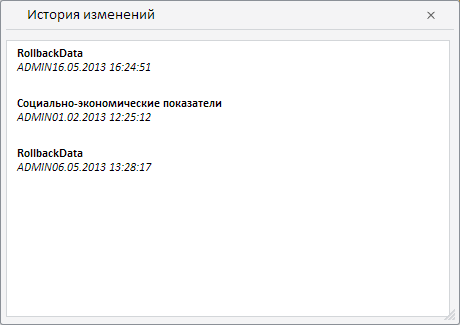

# TSService.getCellHistory

TSService.getCellHistory
-

# TSService.getCellHistory

## Синтаксис

getCellHistory (wbk, row, column, callback);

## Параметры

wbk. Задает значение [рабочей книги](../Workbook/Workbook.htm);

row. Задает индекс строки;

column. Задает индекс колонки;

callback. Задает обработчик окончания выполнения операции.

## Описание

Метод getCellHistory возвращает ревизии для точки (историю изменений точки).

## Комментарии

В методе выполняется двойной запрос, сначала берутся все ревизии для базы данных временных рядов, потом берётся измерение с ревизиями для конкретной точки, потом из них формируется ревизии для конкретной точки.

## Пример

Для выполнения примера предполагается наличие на странице компонента [WorkbookBox](../../../Components/TimeSeries/WorkbookBox/WorkbookBox.htm) с наименованием «workbookBox» (см. «[Пример создания компонента WorkbookBox](../../../Components/TimeSeries/WorkbookBox/Component_WorkbookBox.htm)»), также необходимо в обработчике события открытия документа добавить следующий код:

	var getCellHistoryButt = new PP.Ui.Button({
		ParentNode: document.body, //Родительский узел DOM
		Content: "OK", //Подпись
		Click: PP.Delegate(onClickGetCellHistory)
	});
	function onClickGetCellHistory()
	{
		var gridView = workbookBox.getDataView().getGridView();
		if (!gridView._HistoryWindow)
		gridView._HistoryWindow = new PP.TS.Ui.HistoryWindow();
		gridView._HistoryWindow.showDialog();

		var source = workbookBox.getSource().getActiveSheet();//возвращаем экземпляр класса PP.TS.Workbook
		//Устанавливаем объект, содержащий информацию о значениях выделенных в таблице ячеек
		var selCell = source.getSelectedTableCells().cells.c[0];
		var row, column;
		row = selCell['@row'];
		column = selCell['@column'];
		tsService.getCellHistory(source, row, column, PP.Delegate(function(sender, args)
		{
			gridView.getHistoryWindow().getRevisionsListBox().setRevisions(args.Revs);
		}));
	}

После выполнения примера на html-странице будет размещен компонент [WorkbookBox](../../../Components/TimeSeries/WorkbookBox/WorkbookBox.htm) и кнопка с наименованием «OK». После выбора ячейки и нажатия на кнопку, будет выведено сообщение, содержащее историю изменений для этой точки:

См. также:

[TSService](TSService.htm)

		Справочная
		 система на версию 10.9
		 от 18/08/2025,
		 © ООО «ФОРСАЙТ»,
