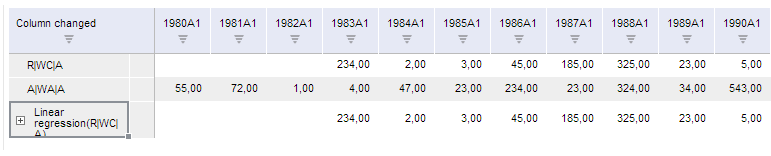

# TSService.getChangeColumnsSettings

TSService.getChangeColumnsSettings
-

# TSService.getChangeColumnsSettings

## Синтаксис

getChangeColumnsSettings (wbk, columns);

## Параметры

wbk. Задает значение [рабочей книги](../Workbook/Workbook.htm);

columns. Задает столбцы.

## Описание

Метод getChangeColumnsSettings возвращает тело запроса изменения столбцов в рабочей книге.

## Пример

Для выполнения примера предполагается наличие на странице компонента [WorkbookBox](../../../Components/TimeSeries/WorkbookBox/WorkbookBox.htm) с наименованием «workbookBox» (см. «[Пример создания компонента WorkbookBox](../../../Components/TimeSeries/WorkbookBox/Component_WorkbookBox.htm)»), также необходимо в обработчике открытия документа добавить следующий код:

	var changeColumnsSettingsButt = new PP.Ui.Button({
		ParentNode: document.body, //родительский узел DOM
		Content: "Изменить параметры столбцов", //подпись
		Click: PP.Delegate(onClickgetChangeColumnsSettings)
	});

	function onClickgetChangeColumnsSettings()
	{
		var source = workbookBox.getSource();//Возвращаем экземпляр класса PP.TS.WbkDocument
		var columns = wbk.getWbkMetadata().columns;
		//Изменяем надпись на заголовке колонки
		columns.its.it[0].customTitle = 'Column changed';
		//Изменяем столбцы рабочей книги
		var body = tsService.getChangeColumnsSettings(wbk, columns);
		wbk.setIsChanged(true);
		tsService._invokeRemoteProc(wbk, body, PP.Delegate(onColumnsChanged, this));

		// Обработчик события окончания выполнения функции changeColumns
		function onColumnsChanged(sender, args){
			//Обновляем компонент workbookBox
			workbookBox.refreshAll();
		}
	}

После выполнения примера на html-странице будет размещена кнопка с наименованием «Изменить параметры столбцов», при нажатии на которую для столбца с индексом 0 будет установлен заголовок «Column changed».

См. также:

[TSService](TSService.htm)

		Справочная
		 система на версию 10.9
		 от 18/08/2025,
		 © ООО «ФОРСАЙТ»,
