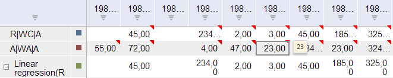

# TSService.getEditAllSeriesSettings

TSService.getEditAllSeriesSettings
-

# TSService.getEditAllSeriesSettings

## Синтаксис

getEditAllSeriesSettings (wbk, allSeries);

## Параметры

wbk. Задает значение [рабочей книги](../Workbook/Workbook.htm);

allSeries. Задает ряды.

## Описание

Метод getEditAllSeriesSettings возвращает тело запроса изменения всех рядов в рабочей книге.

## Пример

Для выполнения примера предполагается наличие на странице компонента [WorkbookBox](../../../Components/TimeSeries/WorkbookBox/WorkbookBox.htm) с наименованием «workbookBox» (см. «[Пример создания компонента WorkbookBox](../../../Components/TimeSeries/WorkbookBox/Component_WorkbookBox.htm)»), также необходимо в обработчике события открытия документа добавить следующий код:

	var editAllSeriesButt = new PP.Ui.Button({
		ParentNode: document.body, //Родительский узел DOM
		Content: "Редактировать ряды", //Подпись
		Click: PP.Delegate(onClickEditAllSeries)
		});
	function onClickEditAllSeries()
	{
		//Создаем объект, в котором содержится информация о типе всплывающей подсказки:
		//7 - Значение;
		//5 - Дата;
		//8 - Примечание.
		var series ={ its: { it: [] }, commentAttribute : {k : 7} };//Тип подсказки - значение
		//Получаем тело запроса установки всплывающей подсказки к рядам рабочей книги
		var body = tsService.getEditAllSeriesSettings(wbk, series);
		//Устанавливаем признак того, что рабочая книга изменена
		wbk.setIsChanged(true);
		callback = tsService._visitCallback(onRowsEdited, new PP.Delegate(tsService._OnOpened, tsService, { Workbook: wbk }));
		//Посылаем на сервер запрос установки всплывающей подсказки
		tsService._send(body, callback);
		function onRowsEdited(){
			//Обновляем компонент workbookBox
			workbookBox.refreshAll();
		}
	}

После выполнения примера на html-странице будет размещена кнопка с наименованием «Редактировать ряды». После нажатия на кнопку при наведении курсора на ячейку, помеченную красной меткой в таблице, во всплывающей подсказке будет отображаться значение ячейки:

См. также:

[TSService](TSService.htm)

		Справочная
		 система на версию 10.9
		 от 18/08/2025,
		 © ООО «ФОРСАЙТ»,
