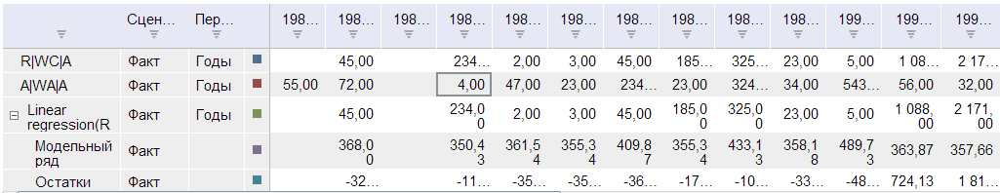
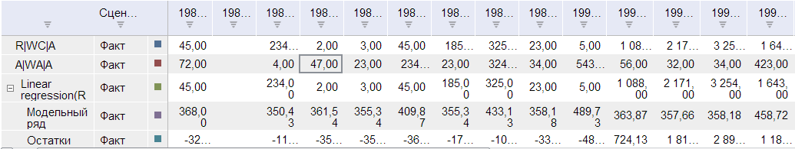

# TSService.removeColumns

TSService.removeColumns
-

# TSService.removeColumns

## Синтаксис

removeColumns (wbk, columns, callback);

## Параметры

wbk. Задает значение [рабочей
 книги](../Workbook/Workbook.htm);

columns. Задает столбцы в
 таблице;

callback. Задает обработчик
 окончания выполнения операции.

## Описание

Метод removeColumns удаляет
 столбцы атрибутов рабочей книги.

## Пример

Для выполнения примера предполагается наличие на странице компонента
 [WorkbookBox](../../../Components/TimeSeries/WorkbookBox/WorkbookBox.htm)
 с наименованием «workbookBox» (см. «[Пример
 создания компонента WorkbookBox](../../../Components/TimeSeries/WorkbookBox/Component_WorkbookBox.htm)»), также необходимо в обработчике
 события открытия документа добавить следующий код:

	//К событию окончания соединения с метабазой добавим обработчик, который
	//устанавливает доступность кнопки  "Удалить последний столбец", в зависимости от количества столбцов атрибутов
	metabase.EndRequest.add(PP.Delegate(function(){
		if(wbk.getActiveSheet().getWbkMetadata().columns.its.it.length > 1)
		{
			removeColumnButt.setEnabled(true);
		}
		else
		{
			removeColumnButt.setEnabled(false);
		}
	}));

	var removeColumnButt = new PP.Ui.Button({
		ParentNode: document.body, //Родительский узел DOM
		Content: 'Удалить последний столбец атрибутов', //Подпись
		Click: PP.Delegate(onClickRemoveColumn)
	});
	function onClickRemoveColumn()
	{
		//Получаем массив столбцов атрибутов рабочей книги
		var columns = wbk.getActiveSheet().getWbkMetadata().columns.its.it;
		//Создаем объект, который будет содержать информацию об удаляемом последнем столбце атрибутов
		var column = [{
			k: columns[columns.length-1].k,
			type: columns[columns.length-1].type,
			vis: columns[columns.length-1].vis,
			readOnly: columns[columns.length-1].readOnly
		}];
		//Удаляем последний столбец атрибутов
		tsService.removeColumns(wbk.getActiveSheet(), column, PP.Delegate(onResponse));
		function onResponse(sender, args)
		{
			//Обновляем компонент workbookBox
			workbookBox.refreshAll();
		}
	}

После выполнения примера на html-странице будет размещена кнопка с наименованием
 «Удалить последний столбец». Для того чтобы кнопка была активна, необходимо
 чтобы в рабочей книге было более одного столбца атрибутов . Для того,
 чтобы добавить столбец атрибутов в рабочую книгу нужно в панели свойств
 рабочей книги «Данные» на вкладке «Формат»  в дереве «Атрибуты» выделить
 одну или более вершин.

По нажатию на кнопку последний столбец атрибутов в рабочей книге будет
 удален.

До нажатия на кнопку:

После нажатия на кнопку:

См. также:

[TSService](TSService.htm)

		Справочная
		 система на версию 10.9
		 от 18/08/2025,
		 © ООО «ФОРСАЙТ»,
