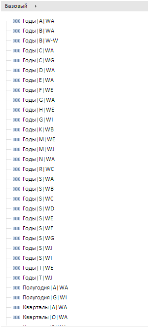

# TSService.setAttrsTreeOptions

TSService.setAttrsTreeOptions
-

# TSService.setAttrsTreeOptions

## Синтаксис

setAttrsTreeOptions (wbkDocument, rubKey, xmlStr, callback);

## Параметры

wbkDocument. Задает документ [рабочей книги](../Workbook/Workbook.htm);

rubKey. Задает ключ каталога показателей;

xmlStr. Задает XML-строка с настройками;

callback. Задает обработчик завершения операции.

## Описание

Метод setAttrsTreeOptions используется для настройки атрибутов в иерархии рядов рабочей книги.

## Пример

Для выполнения примера предполагается наличие на странице компонента [WorkbookBox](../../../Components/TimeSeries/WorkbookBox/WorkbookBox.htm) с наименованием «workbookBox» (см. «[Пример создания компонента WorkbookBox](../../../Components/TimeSeries/WorkbookBox/Component_WorkbookBox.htm)»), также необходимо в обработчике события открытия документа добавить следующий код:

var setAttrsTreeOptionsButt = new PP.Ui.Button({
	ParentNode: document.body, //родительский узел DOM
	Content: "Установить первоначальный набор атрибутов", //подпись
	Click: PP.Delegate(onClickSetAttrsTreeOptions)
});
function onClickSetAttrsTreeOptions()
	{
		//Получаем ключ базы данных временных рядов
		var rubKey = wbk.getActiveSheet().getRub().meta.obInst.obDesc.k;
		var xmlStr = "<Breadcrumb></Breadcrumb>";
		//Устанавливаем настрйки атрибутов в иерархии рядов в рабочей книге
		tsService.setAttrsTreeOptions(wbk, rubKey, xmlStr);
		//Устанавливаем настройки отображения звеньев навигационной цепочки
		var options = workbookBox.getDataView().getBreadcrumb().getOptions();
		options = null;
		options = new PP.TS.MetaAttrBrCrOptionParser({
			XML: xmlStr //строка XML для парсинга
		});
		workbookBox.getDataView().getBreadcrumb().setOptions(options);
		workbookBox.getDataView().getBreadcrumb().refreshAll();
	}

После выполнения примера на html-странице будет размещена кнопка «Установить первоначальный набор атрибутов». При нажатии на кнопку будут установлены звенья навигационной цепочки, в соответствии с xml - строкой.

См. также:

[TSService](TSService.htm)

		Справочная
		 система на версию 10.9
		 от 18/08/2025,
		 © ООО «ФОРСАЙТ»,
