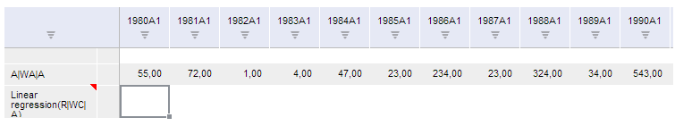

# TSService.setSeriesAttr

TSService.setSeriesAttr
-

# TSService.setSeriesAttr

## Синтаксис

setSeriesAttr (wbk, series, callback);

## Параметры

wbk. Задает значение [рабочей
 книги](../Workbook/Workbook.htm);

series. Задает ряды;

callback. Задает обработчик
 окончания выполнения операции.

## Описание

Метод setSeriesAttr устанавливает
 атрибуты ряда.

## Пример

Для выполнения примера предполагается наличие на странице компонента
 [WorkbookBox](../../../Components/TimeSeries/WorkbookBox/WorkbookBox.htm)
 с наименованием «workbookBox» (см. «[Пример
 создания компонента WorkbookBox](../../../Components/TimeSeries/WorkbookBox/Component_WorkbookBox.htm)»), также необходимо в обработчике
 события открытия документа добавить следующий код:

var setSeriesAttrButt = new PP.Ui.Button({
	ParentNode: document.body, //родительский узел DOM
	Content: "Установить набор атрибутов", //подпись
	Click: PP.Delegate(onClickSetSeriesAttr)
});
function onClickSetSeriesAttr()
	{
		//Задаем значение рабочей книги
		var wbk = args.Workbook;
		//Получим первый ряд рабочей книги
		var serie = [wbk.getActiveSheet().getSeries()[0]];
		var firstVisiblearrtibute;
		//Получаем первый видимый и не предопределенный атрибут первого ряда
		var origAttributes = serie[0].atts.its.it
		for (var i = 0; i < origAttributes.length; i++)
			{
				if (origAttributes[i].predefined == false && origAttributes[i].vis == true)
					{
						firstVisiblearrtibute = {
							dt: origAttributes[i].dt,
							id: origAttributes[i].id,
							k: origAttributes[i].k,
							n: origAttributes[i].n,
							predefined: false,
							value: ""
						}
						break;
					}
				}
		//Создаем объект, который используется в качестве параметра к методу setSeriesAttr
		series = [{
			k: serie[0].k,
			atts:{its:{it: [firstVisiblearrtibute]}},
			id: serie[0].id,
			kind: serie[0].kind,
			selectedUnit: ""
		}];
		//Устанавливаем атрибуты первого ряда
		tsService.setSeriesAttr(wbk, series, PP.Delegate(onSetAttr, this));
		//Задает обработчик завершения метода
		function onSetAttr(){
			 //Обновляем таблицу
			var gridView = workbookBox.getDataView().getGridView();
			gridView.getInstance().reset();
			};
	}

После выполнения примера на html-странице будет размещена кнопка с наименованием
 «Установить набор атрибутов». Для выполнения примера также необходимо
 выделить первый ряд рабочей книги, на вкладке панели свойств «Ряд»
 открыть панель для редактирования «Атрибуты ряда», затем выбрать значение
 для первого атрибута и нажать на кнопку «Установить набор атрибутов».
 После нажатия на кнопку у первого ряда рабочей книги изменятся данные
 и выбранное значение в панели для редактирования значений атрибутов выделенных
 рядов снимется, о чем будет свидетельствовать текст «Выделено(0)» в поле
 для ввода текста.

См. также:

[TSService](TSService.htm)

		Справочная
		 система на версию 10.9
		 от 18/08/2025,
		 © ООО «ФОРСАЙТ»,
