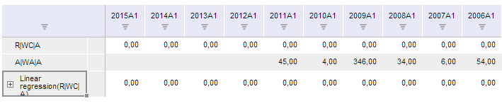

# TSService.setSort

TSService.setSort
-

# TSService.setSort

## Синтаксис

setSort (wbk, sortingEnabled, reverseHeader, direction, column, callback);

## Параметры

wbk. Задает рабочую книгу, экземпляр класса [Workbook](../Workbook/Workbook.htm);

sortingEnabled. Задает признак включения сортировки;

reverseHeader. Определяет порядок следования элементов календаря;

direction. Задает направление сортировки;

column. Задает столбец сортировки;

callback. Задает обработчик завершения операции .

## Описание

Метод setSort устанавливает сортировку рядов рабочей книги.

## Комментарии

Параметр reverseHeader может принимать следующие значения:

-
false - прямой порядок дат (по возрастанию);

-
true - обратный порядок дат (по убыванию).

## Пример

Для выполнения примера предполагается наличие на странице компонента [WorkbookBox](../../../Components/TimeSeries/WorkbookBox/WorkbookBox.htm) с наименованием «workbookBox» (см. «[Пример создания компонента WorkbookBox](../../../Components/TimeSeries/WorkbookBox/Component_WorkbookBox.htm)»), также необходимо в обработчике события открытия документа добавить следующий код:

	var setSortButt = new PP.Ui.Button({
		ParentNode: document.body, //родительский узел DOM
		Content: "Установить сортировку", //подпись
		Click: PP.Delegate(onClickSetSort)
	});

	function onClickSetSort()
	{
		var wbk = args.Workbook;
		var sortingEnabled = true;
		var reverseHeader = true;
		var direction = 'west';
		var column = 0;
		tsService.setSort(wbk, sortingEnabled, reverseHeader, direction, column, PP.Delegate(onSetSort,this));
		// Обработчик завершения метода setSort
		function onSetSort(sender, args){
			workbookBox.refreshAll();
		}
	}

После выполнения примера на html-странице будет размещен компонент [WorkbookBox](../../../Components/TimeSeries/WorkbookBox/WorkbookBox.htm) и кнопка с наименованием «Установить сортировку». После нажатия на кнопку к рядам рабочей книги будет применена сортировка в порядке убывания дат:

См. также:

[TSService](TSService.htm)

		Справочная
		 система на версию 10.9
		 от 18/08/2025,
		 © ООО «ФОРСАЙТ»,
