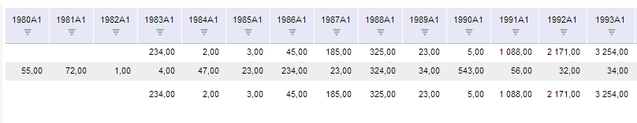
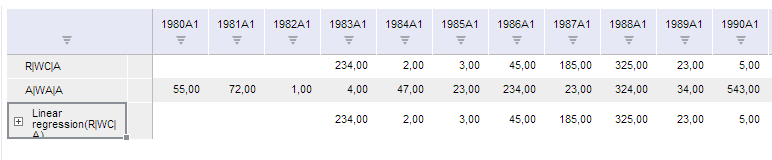

# TSService.setTableFixHeaders

TSService.setTableFixHeaders
-

# TSService.setTableFixHeaders

## Синтаксис

setTableFixHeaders (report, metadata, callback);

## Параметры

report. Задает объект;

metadata. Задает метаданные
 с настройками фиксированных областей;

callback. Задает обработчик
 завершения операции.

## Описание

Метод setTableFixHeaders используется
 для установки фиксированных областей таблицы.

## Пример

Для выполнения примера предполагается наличие на странице компонента
 [WorkbookBox](../../../Components/TimeSeries/WorkbookBox/WorkbookBox.htm)
 с наименованием «workbookBox» (см. «[Пример
 создания компонента WorkbookBox](../../../Components/TimeSeries/WorkbookBox/Component_WorkbookBox.htm)»), также необходимо в обработчике
 события открытия документа добавить следующий код:

var setTableFixHeadersButt = new PP.Ui.Button({
	ParentNode: document.body, //Родительский узел DOM
	Content: "Установить фиксированные области", //Подпись
	Click: PP.Delegate(onClickTableFixHeaders)
});
var x  = false;
function onClickTableFixHeaders()
	{
		var source = workbookBox.getSource().getActiveSheet();//возвращаем экземпляр класса PP.TS.Workbook
		//Создаем объект, содержащий признак установки фиксированных областей таблицы
		var metadata = {fixHeaders: x}
		//Устанавливаем фиксированные области таблицы
		tsService.setTableFixHeaders(source, metadata, PP.Delegate(onResponse));
		function onResponse(sender, args)
			{
				//При повторном нажатии на кнопку установка фиксированных областей будет изменена
				x = !x;
				//Обновляем компонент для отображения рабочей книги
				workbookBox.refreshAll();
			}
	}

После выполнения примера на html-странице будет размещена кнопка с наименованием
 «Установить фиксированные области». При нажатии на кнопку будут скрываться/отображаться
 фиксированные области таблицы:

или

См. также:

[TSService](TSService.htm)

		Справочная
		 система на версию 10.9
		 от 18/08/2025,
		 © ООО «ФОРСАЙТ»,
