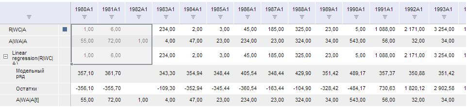

# TSService.setTableSelection

TSService.setTableSelection
-

# TSService.setTableSelection

## Синтаксис

setTableSelection (wbk, selectedIndexSeries, selectedIndexCols, callback, selection, left, top, width, height);

## Параметры

wbk. Задает рабочую книгу, экземпляр класса [Workbook](../Workbook/Workbook.htm);

selectedIndexSeries. Задает массив индексов рядов в таблице;

selectedIndexCols. Задает массив индексов столбцов в таблице;

callback. Задает обработчик окончания выполнения операции;

selection. Задает устанавливаемую отметку;

left. Задает индекс левой ячейки отметки;

top. Задает индекс верхней ячейки отметки;

width. Если таблица повёрнута, то - ширина таблицы без учёта фиксированных областей, иначе всегда равно 1;

height. Если таблица повёрнута, то всегда равно 1, иначе высота таблицы без учёта фиксированных областей.

## Описание

Метод setTableSelection устанавливает отметку в таблице.

## Пример

Для выполнения примера предполагается наличие на странице компонента [WorkbookBox](../../../Components/TimeSeries/WorkbookBox/WorkbookBox.htm) с наименованием «workbookBox» (см. «[Пример создания компонента WorkbookBox](../../../Components/TimeSeries/WorkbookBox/Component_WorkbookBox.htm)»), также необходимо чтобы в открытой рабочей книге было минимум три ряда, и минимум 4 столбца, а в обработчике события открытия документа необходимо добавить следующий код:

var setTableSelectionButt = new PP.Ui.Button({
	ParentNode: document.body, //Родительский узел DOM
	Content: "Выделить", //Подпись
	Click: PP.Delegate(onClickTableSelection)
});
function onClickTableSelection()
	{
		var source = workbookBox.getSource().getActiveSheet();//возвращаем экземпляр класса PP.TS.Workbook
		var selectedIndexSeries = [0,1,2];
		var selectedIndexCols  = [2,4]
		var selection = {"range": {}, "type": "Normal"};
		selection.range =
			{
				"height": 0,
				"left": 0,
				"parts": {},
				"top": 0,
				"type": "MultiPart",
				"width": 0
			}
		selection.range.parts = {it : []};
		selection.range.parts.it.push(
			{
				"height": 3,
				"left": 11,
				"top": 1,
				"type": "Cells",
				"width": 3
			});
		var left = 1;
		var	top = 1;
		var	width = 1;
		var	height = 3;
		//Устанавливаем отметку в таблице
		tsService.setTableSelection(source, selectedIndexSeries, selectedIndexCols, PP.Delegate(onResponse), selection, left, top, width, height);
		function onResponse(sender, args)
			{
				var wbk = args.Args.Workbook;
				var minSer = Math.min.apply(null, wbk.getSelectedIndexSeries())+1;
				var maxSer = Math.max.apply(null, wbk.getSelectedIndexSeries())+1;
				var minCols = Math.min.apply(null, wbk.getSelectedIndexCols());
				var maxCols = Math.max.apply(null, wbk.getSelectedIndexCols());
				var gv = workbookBox.getDataView().getGridView();
				var selection = gv.getSelection();
				gv._GridSelection._SelectedAreas[0].Range._Corners.blCoord.colIndex = minCols;
				gv._GridSelection._SelectedAreas[0].Range._Corners.blCoord.rowIndex = maxSer;
				gv._GridSelection._SelectedAreas[0].Range._Corners.brCoord.colIndex = maxCols;
				gv._GridSelection._SelectedAreas[0].Range._Corners.brCoord.rowIndex = maxSer;
				gv._GridSelection._SelectedAreas[0].Range._Corners.tlCoord.colIndex = minCols;
				gv._GridSelection._SelectedAreas[0].Range._Corners.tlCoord.rowIndex = minSer;
				gv._GridSelection._SelectedAreas[0].Range._Corners.trCoord.colIndex = maxCols;
				gv._GridSelection._SelectedAreas[0].Range._Corners.trCoord.rowIndex = minSer;
				workbookBox.getDataView()._TabStatPanel.expand();
				workbookBox.getDataView()._TabStatPanel.collapse();
			}
	}

После выполнения примера на html-странице будет размещена кнопка с наименованием «Выделить». При нажатии на которую, в таблице будет выделен ячейки, заданный в параметрах метода setTableSelection:

См. также:

[TSService](TSService.htm)

		Справочная
		 система на версию 10.9
		 от 18/08/2025,
		 © ООО «ФОРСАЙТ»,
