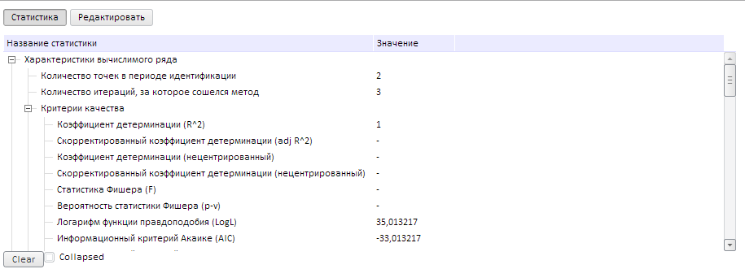

# Конструктор TabStatPanel

Конструктор TabStatPanel
-

# Конструктор TabStatPanel

## Синтаксис

PP.TS.Ui.TabStatPanel (settings);

## Параметры

settings. JSON-объект
 со значениями свойств компонента.

## Описание

Конструктор TabStatPanel создает
 экземпляр класса [TabStatPanel](TabStatPanel.htm).

## Пример

Для выполнения примера создайте html-страницу и выполните следующие
 действия:

1. Добавьте ссылки на следующие js и css-файлы:

	- PP.css;

	- PP.Express.css;

	- PP.TS.css;

	- PP.Metabase.css;

	- PP.js;

	- PP.Metabase.js;

	- PP.TabSheet.js;

	- PP.Express.js;

	- PP.TS.js.

Также необходимо наличие рабочей книги с ключом 5183.

2. В теге SCRIPT добавьте следующий скрипт:

3. В теге <body> в качестве значения атрибута «onLoad» укажите
 имя функции, которая выполняется после окончания загрузки тела страницы:

<body onload="Ready()">
	

</body>

4. В конце документа вставьте код, устанавливающий стили к вершине «document.body»,
 соответствующие операционной системе клиента:

После выполнения примера на html-странице будет размещен экземпляр класса
 [TabStatPanel](TabStatPanel.htm), имеющий следующий вид:

В пример был добавлен флажок с наименованием «Collapsed», при его установке/снятии
 сворачивается/разворачивается панель статистик. Это связано с генерацией
 события [Toggled](TabStatPanel.Toogled.htm).

Также была добавлена кнопка с наименованием «Clear», после нажатия на
 которую очищается дерево характеристик панели статистик (см. «[TabStatPanel.clear](TabStatPanel.clear.htm)»).

См. также:

[TabStatPanel](TabStatPanel.htm)

		Справочная
		 система на версию 10.9
		 от 18/08/2025,
		 © ООО «ФОРСАЙТ»,
