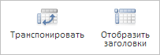

# TableCatView.getTableAnalysisButtonAngle

TableCatView.getTableAnalysisButtonAngle
-

# TableCatView.getTableAnalysisButtonAngle

## Синтаксис

getTableAnalysisButtonAngle();

## Описание

Метод getTableAnalysisButtonAngle
 возвращает кнопку «Поворот таблицы» на ленте инструментов рабочей книги.

## Комментарии

Метод возвращает объект типа [PP.Ui.RibbonButton](dhtmlRibbon.chm::/Classes/RibbonButton/RibbonButton.htm).

## Пример

Для выполнения примера необходимо наличие на html-странице компонента
 [WorkbookBox](../../../Components/TimeSeries/WorkbookBox/WorkbookBox.htm)
 с наименованием «workbookBox» (см. «[Пример
 создания компонента WorkbookBox](../../../Components/TimeSeries/WorkbookBox/Component_WorkbookBox.htm)»). Перейдите на вкладку «Таблица»
 ленты инструментов рабочей книги. Переименуем кнопки «Поворот таблицы»
 и «Разметка»:

// Получим ленту инструментов
var ribbon = workbookBox.getRibbonView();
// Получим вкладку «Таблица»
var tableCatView = ribbon.getTableCategory();
// Получим кнопки «Поворот таблицы» и «Разметка»
var angleButton = tableCatView.getTableAnalysisButtonAngle();
var layoutButton = tableCatView.getTableAnalysisButtonLayout();
// Определим новое название для обеих кнопок
angleButton.setContent("Транспонировать");
layoutButton.setContent("Отобразить заголовки");
// Обновим вкладку «Таблица»
tableCatView.refresh();

В результате выполнения примера наименования кнопок «Поворот таблицы»
 и «Разметка» были изменены соответственно на «Транспонировать» и «Отобразить
 заголовки»:

См. также:

[TableCatView](TableCatView.htm)

		Справочная
		 система на версию 10.9
		 от 18/08/2025,
		 © ООО «ФОРСАЙТ»,
