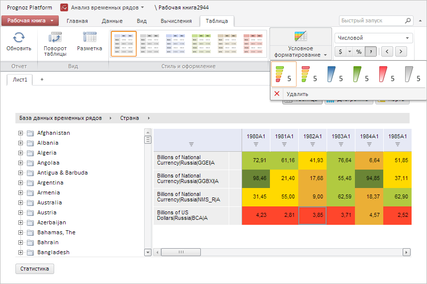

# TableCatView.getTableCondFormatButton

TableCatView.getTableCondFormatButton
-

# TableCatView.getTableCondFormatButton

## Синтаксис

getTableCondFormatButton();

## Описание

Метод getTableCondFormatButton
 возвращает кнопку «Условное форматирование» на ленте инструментов рабочей
 книги.

## Комментарии

Метод возвращает объект типа [PP.Ui.SplitButton](dhtmlUi.chm::/Classes/SplitButton/SplitButton.htm).

## Пример

Для выполнения примера необходимо наличие на html-странице компонента
 [WorkbookBox](../../../Components/TimeSeries/WorkbookBox/WorkbookBox.htm)
 с наименованием «workbookBox» (см. «[Пример
 создания компонента WorkbookBox](../../../Components/TimeSeries/WorkbookBox/Component_WorkbookBox.htm)»), а также должна быть открыта вкладка
 «Таблица» на ленте инструментов рабочей книги. Выберем у кнопки «Условное
 форматирование» на данной вкладке первый пункт меню, означающий раскраску
 ячеек путём масштабирования их значений с цветами от красного до зеленого:

// Получим ленту инструментов
var ribbon = workbookBox.getRibbonView();
// Получим вкладку «Таблица»
var tableCatView = ribbon.getTableCategory();
// Создадим все элементы вкладки
tableCatView.renderContent();
// Получим кнопку «Условное форматирование»
var cFormatButton = tableCatView.getTableCondFormatButton();
// Получим меню данной кнопки
var menu = cFormatButton.getMenu();
// Получим первый пункт условного форматирования
var redGreenItem = menu.getItems()[1].getContent().getItems(0)[0];
if (redGreenItem.getValue() == PP.Exp.Ui.TabTablePredefinedScale.RedGreen){
    /* Выберем пункт меню, соответствующий раскраске ячеек
    путём масштабирования их значений с цветами от красного до зеленого */
    redGreenItem.setSelected(true);
    // Отобразим кнопку нажатой
    redGreenItem.setIsHovered(true);
    // Отобразим меню данной кнопки в нужной позиции
    var offset = PP.calculateOffset(cFormatButton.getDomNode());
    menu.show();
    menu.setCoords(offset.X, offset.Y + cFormatButton.getHeight());
};

В результате выполнения примера для кнопки «Условное форматирование»
 был выбран пункт меню, соответствующий раскраске ячеек путём масштабирования
 их значений с цветами от красного до зеленого:

См. также:

[TableCatView](TableCatView.htm)

		Справочная
		 система на версию 10.9
		 от 18/08/2025,
		 © ООО «ФОРСАЙТ»,
