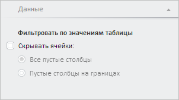

# Конструктор TablePanel

Конструктор TablePanel
-

# Конструктор TablePanel

## Синтаксис

PP.TS.Ui.TablePanel(settings);

## Параметры

settings. JSON-объект со значениями свойств класса.

## Описание

Конструктор TablePanel создает экземпляр класса [TablePanel](TablePanel.htm).

## Пример

Для выполнения примера необходимо наличие на html-странице компонента [WorkbookBox](../../../Components/TimeSeries/WorkbookBox/WorkbookBox.htm) с наименованием «workbookBox» (см. «[Пример создания компонента WorkbookBox](../../../Components/TimeSeries/WorkbookBox/Component_WorkbookBox.htm)»). Создадим панель настроек таблицы и добавим её на панель свойств рабочей книги:

// Получим панель свойств рабочей книги
var propertyBar = workbookBox.getPropertyBarView();
// Создадим панель настроек таблицы
var tablePanel = new PP.TS.Ui.TablePanel({
    Source: workbookBox.getSource(), // Источник данных
    Mode: PP.TS.Ui.WbkTablePanMode.Filter, // Вид настроек панели
    ResourceKey: "WorkbookPropertyData",
    IsHeaderControlVisible: false, // Скроем элемент управления в заголовке
    ViewType: PP.Ui.NavigationItem
});
// Добавим панель настроек таблицы на панель свойств
propertyBar.addMasterPanel(tablePanel);
// Покажем и раскроем данную панель
tablePanel.show();
tablePanel.expand();

В результате выполнения примера была создана панель настроек таблицы. Затем она была добавлена на панель свойств рабочей книги, отображена и раскрыта:

См. также:

[TablePanel](TablePanel.htm)

		Справочная
		 система на версию 10.9
		 от 18/08/2025,
		 © ООО «ФОРСАЙТ»,
