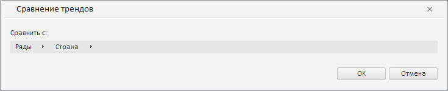

# TrendWizard.CurrentState

TrendWizard.CurrentState
-

**

# TrendWizard.CurrentState

## Синтаксис

CurrentState: Object

## Описание

Свойство CurrentState** определяет текущие настройки мастера для валидации данных путём сравнения трендов временных рядов.

## Комментарии

Значение свойства устанавливается с помощью метода setCurrentState, а возвращается с помощью метода getCurrentState. Из JSON значение задать нельзя.

## Пример

Для выполнения примера необходимо наличие на html-странице экземпляра класса [TrendWizard](TrendWizard.htm) с наименованием «trendWizard» (см. «[Конструктор TrendWizard](Constructor_TrendWizard.htm)»), а также наличие в источнике данных рабочей книги атрибута наблюдений с идентификатором «COUNTRIES» и ключом 10. Определим новые настройки для мастера валидации данных путём сравнения трендов временных рядов:

// Определим новые настройки для мастера
var state = {
    "comparator": {
        "its": {
            "it": [{
                    /* Определим атрибут ряда */
                    "k": 9, // Ключ атрибута
                    "id": "COUNTRY", // Идентификатор атрибута
                    "n": "Country" // Наименование атрибута
                }
            ]
        }
    }
}
// Применим данные настройки
trendWizard.setCurrentState(state);

В результате выполнения примера в рассматриваемом мастере для сравнения был установлен атрибут «Страна»:

См. также:

[TrendWizard](TrendWizard.htm)

		Справочная
		 система на версию 10.9
		 от 18/08/2025,
		 © ООО «ФОРСАЙТ»,
