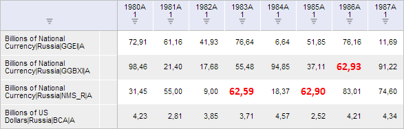
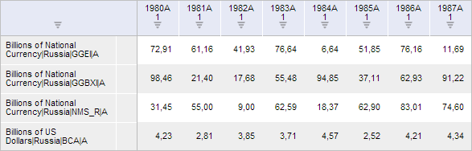

# ValidationCatView.getClearButton

ValidationCatView.getClearButton
-

**

# ValidationCatView.getClearButton

## Синтаксис

getClearButton();

## Описание

Метод getClearButton** возвращает кнопку «Очистить» на вкладке «Валидация» ленты инструментов рабочей книги.

## Комментарии

Метод возвращает объект типа [PP.Ui.RibbonButton](dhtmlRibbon.chm::/Classes/RibbonButton/RibbonButton.htm).

При нажатии на данную кнопку в рабочей книге будут очищены все ошибки валидации.

## Пример

Для выполнения примера необходимо наличие на html-странице компонента [WorkbookBox](../../../Components/TimeSeries/WorkbookBox/WorkbookBox.htm) с наименованием «workbookBox» (см. «[Пример создания компонента WorkbookBox](../../../Components/TimeSeries/WorkbookBox/Component_WorkbookBox.htm)») и с загруженной таблицей в области данных рабочей книги. Также должно быть выполнено правило валидации, которое находит как минимум одно недопустимое значение:

Очистим все ошибки валидации:

// Получим ленту инструментов рабочей книги
var ribbon = workbookBox.getRibbonView();
// Получим вкладку «Валидация»
var validationCategory = ribbon.getValidationCategory();
// Отобразим её и откроем
validationCategory.setIsHiddenActive(true)
ribbon.refreshAll();
// Получим кнопку «Очистить»
var clearButton = validationCategory.getClearButton();
// Вызовем событие нажатия на данную кнопку
clearButton.Click.fire(this);

В результате выполнения примера были убраны все ошибки валидации:

См. также:

[ValidationCatView](ValidationCatView.htm)

		Справочная
		 система на версию 10.9
		 от 18/08/2025,
		 © ООО «ФОРСАЙТ»,
