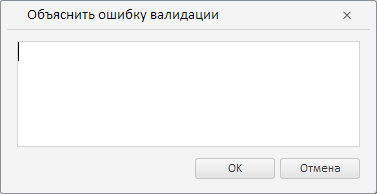
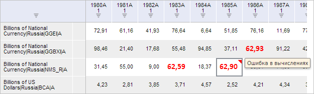
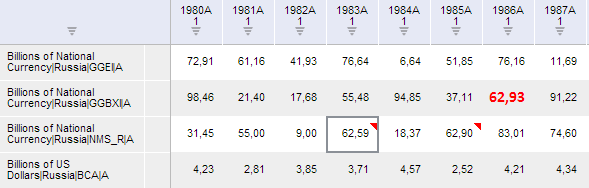

# ValidationCatView.getExplainButton

ValidationCatView.getExplainButton
-

**

# ValidationCatView.getExplainButton

## Синтаксис

getExplainButton();

## Описание

Метод getExplainButton**
 возвращает кнопку «Объяснить» на вкладке «Валидация» ленты инструментов
 рабочей книги.

## Комментарии

Метод возвращает объект типа [PP.Ui.RibbonButton](dhtmlRibbon.chm::/Classes/RibbonButton/RibbonButton.htm).

При нажатии на данную кнопку будет отображено окно для ввода
 текста, объясняющего выбранную ошибку валидации.

## Пример

Для выполнения примера необходимо наличие на html-странице компонента
 [WorkbookBox](../../../Components/TimeSeries/WorkbookBox/WorkbookBox.htm)
 с наименованием «workbookBox» (см. «[Пример
 создания компонента WorkbookBox](../../../Components/TimeSeries/WorkbookBox/Component_WorkbookBox.htm)») и с загруженной таблицей в области
 данных рабочей книги. Также должно быть выполнено правило валидации, которое
 находит как минимум два недопустимых значений:

Объясним последнюю ошибку валидации:

// Получим ленту инструментов рабочей книги
var ribbon = workbookBox.getRibbonView();
// Получим вкладку «Валидация»
var validationCategory = ribbon.getValidationCategory();
// Отобразим её и откроем
validationCategory.setIsHiddenActive(true)
ribbon.refreshAll();
// Получим кнопку «Последняя ошибка»
var lastErrorButton = validationCategory.getLastErrorButton();
// Сымитируем нажатие на данную кнопку
lastErrorButton.Click.fire(lastErrorButton);
// Получим кнопку «Объяснить»
var explainButton = validationCategory.getExplainButton();
// Сымитируем нажатие данной кнопки
explainButton.Click.fire(explainButton);

В результате выполнения сценария была выделена ячейка, соответствующая
 последней ошибке валидации, а также было отображено окно «Объяснить
 ошибку валидации»:

 

Введём в диалог текст «Ошибка в вычислениях» и нажмём на кнопку «OK».
 После этого последняя ошибка валидации будет считаться как объяснённая,
 а соответствующая ей ячейка будет иметь комментарий с введённым ранее
 текстом, отображаемым при наведении указателя мыши:

Далее объясним предпоследнюю ошибку:

// Получим кнопку «Предыдущая ошибка»
var previousErrorButton = validationCategory.getPreviousErrorButton();
// Вызовем событие нажатия на данную кнопку
previousErrorButton.Click.fire(previousErrorButton);
// Объясним данную ошибку
validationCategory.setExplanation("Ошибка в измерениях");
В результате выполнения примера был отображён диалог с текстом «Ошибка
 в измерениях». После нажатия на кнопку «OK» предпоследняя ошибка будет
 помечена как объяснённая (так же, как и в случае с последней ошибкой).

Затем скроем все объяснённые ошибки:

// Получим кнопку «Скрыть объяснённые»
var hideExplanationButton = validationCategory.getHideExplanationButton();
// Отобразим кнопку в нажатом состоянии
hideExplanationButton.setIsPressed(true);
// Сымитируем нажатие данной кнопки
hideExplanationButton.Click.fire(hideExplanationButton);
// Отобразим кнопку в отжатом состоянии
hideExplanationButton.setIsPressed(false);

После выполнения сценария все объяснённые ошибки будут скрыты:

См. также:

[ValidationCatView](ValidationCatView.htm)

		Справочная
		 система на версию 10.9
		 от 18/08/2025,
		 © ООО «ФОРСАЙТ»,
