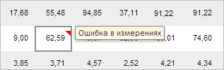

# ValidationCatView.getHideExplanationButton

ValidationCatView.getHideExplanationButton
-

**

# ValidationCatView.getHideExplanationButton

## Синтаксис

getHideExplanationButton();

## Описание

Метод getHideExplanationButton** возвращает кнопку «Скрыть объяснённые» на вкладке «Валидация» ленты инструментов рабочей книги.

## Комментарии

Метод возвращает объект типа [PP.Ui.RibbonButton](dhtmlRibbon.chm::/Classes/RibbonButton/RibbonButton.htm).

При нажатии на данную кнопку в рабочей книге будут скрыты все объяснённые ошибки валидации. При этом соответствующие им ячейки таблицы будут иметь комментарий с текстом объяснения, отображаемым при наведении указателя мыши:

## Пример

Пример использования приведён на странице описания метода [ValidationCatView.getExplainButton](ValidationCatView.getExplainButton.htm).

См. также:

[ValidationCatView](ValidationCatView.htm)

		Справочная
		 система на версию 10.9
		 от 18/08/2025,
		 © ООО «ФОРСАЙТ»,
