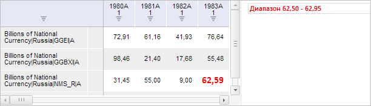

# ValidationCatView.getLegendButton

ValidationCatView.getLegendButton
-

**

# ValidationCatView.getLegendButton

## Синтаксис

getLegendButton();

## Описание

Метод getLegendButton** возвращает кнопку «Легенда» на вкладке «Валидация» ленты инструментов рабочей книги.

## Комментарии

Метод возвращает объект типа [PP.Ui.RibbonButton](dhtmlRibbon.chm::/Classes/RibbonButton/RibbonButton.htm).

При нажатии на данную кнопку в таблице рабочей книги будет отображена легенда со списком выполненных правил валидации.

## Пример

Для выполнения примера необходимо наличие на html-странице компонента [WorkbookBox](../../../Components/TimeSeries/WorkbookBox/WorkbookBox.htm) с наименованием «workbookBox» (см. «[Пример создания компонента WorkbookBox](../../../Components/TimeSeries/WorkbookBox/Component_WorkbookBox.htm)») и с загруженной таблицей в области данных рабочей книги. Также должно быть выполнено как минимум одно правило валидации.

Отобразим в рабочей книге легенду со списком выполненных правил валидации:

// Получим ленту инструментов рабочей книги
var ribbon = workbookBox.getRibbonView();
// Получим вкладку «Валидация»
var validationCategory = ribbon.getValidationCategory();
// Откроем данную вкладку
validationCategory.setIsHiddenActive(true);
ribbon.refreshAll();
// Разрешим отображение элементов валидации
validationCategory.getSource().setShowValidation(true);
// Получим кнопку «Легенда»
var legendButton = validationCategory.getLegendButton();
// Отобразим данную кнопку в нажатом состоянии
legendButton.setIsPressed(true);
// Сымитируем нажатие кнопки «Легенда»
legendButton.Click.fire(legendButton);
// Отобразим данную кнопку в отжатом состоянии
legendButton.setIsPressed(false);
// Обновим вкладку «Валидация»
validationCategory.refresh();

В результате выполнения примера в рабочей книге была отображена легенда, содержащая выполненные правила валидации:

См. также:

[ValidationCatView](ValidationCatView.htm)

		Справочная
		 система на версию 10.9
		 от 18/08/2025,
		 © ООО «ФОРСАЙТ»,
