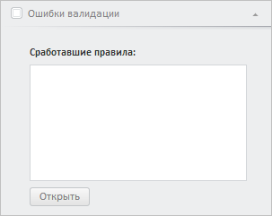

# Конструктор ValidationErrorsPanel

Конструктор ValidationErrorsPanel
-

**

# Конструктор ValidationErrorsPanel

## Синтаксис

PP.TS.Ui.ValidationErrorsPanel(settings: Object);

## Параметры

settings. JSON-объект со значениями
 свойств класса.

## Описание

Конструктор ValidationErrorsPanel** создаёт экземпляр класса [ValidationErrorsPanel](ValidationErrorsPanel.htm).

## Пример

Для выполнения примера необходимо наличие на html-странице компонента
 [WorkbookBox](../../../Components/TimeSeries/WorkbookBox/WorkbookBox.htm)
 с наименованием «workbookBox» (см. «[Пример
 создания компонента WorkbookBox](../../../Components/TimeSeries/WorkbookBox/Component_WorkbookBox.htm)»). Создадим панель правил валидации
 и добавим её на [панель
 свойств рабочей книги](../../../Components/TimeSeries/WbkPropertyBar/WbkPropertyBar.htm):

//var validationPanel = workbookBox.getPropertyBarView().getValidationPanel();
// Получим модель рабочей книги
var workbook = workbookBox.getSource();
// Создадим панель ошибок валидации
var validationErrorsPanel = new PP.TS.Ui.ValidationErrorsPanel({
    ViewType: PP.Ui.NavigationItem,
    // Укажем ключ ресурса для отображения заголовка и подписей на панели
    ResourceKey: "WorkbookPropertyValidationErrors"
});
// Установим источник данных
validationErrorsPanel.setSource(workbook);
// Добавим созданную панель на панель свойств рабочей книги
workbookBox.getPropertyBarView().addMasterPanel(validationErrorsPanel);
// Отобразим панель ошибок валидации и развернём её
validationErrorsPanel.show();
validationErrorsPanel.expand();

В результате выполнения примера была создана панель ошибок валидации.
 Затем она была добавлена на панель свойств рабочей книги, отображена и
 раскрыта:

См. также:

[ValidationErrorsPanel](ValidationErrorsPanel.htm)

		Справочная
		 система на версию 10.9
		 от 18/08/2025,
		 © ООО «ФОРСАЙТ»,
