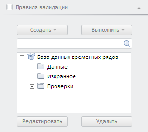

# Конструктор ValidationRulesPanel

Конструктор ValidationRulesPanel
-

**

# Конструктор ValidationRulesPanel

## Синтаксис

PP.TS.Ui.ValidationRulesPanel(settings: Object);

## Параметры

settings. JSON-объект со значениями свойств класса.

## Описание

Конструктор ValidationRulesPanel** создаёт экземпляр класса [ValidationRulesPanel](ValidationRulesPanel.htm).

## Пример

Для выполнения примера необходимо наличие на html-странице компонента [WorkbookBox](../../../Components/TimeSeries/WorkbookBox/WorkbookBox.htm) с наименованием «workbookBox» (см. «[Пример создания компонента WorkbookBox](../../../Components/TimeSeries/WorkbookBox/Component_WorkbookBox.htm)»). Создадим панель правил валидации и добавим её на [панель свойств рабочей книги](../../../Components/TimeSeries/WbkPropertyBar/WbkPropertyBar.htm):

// Получим модель рабочей книги
var workbook = workbookBox.getSource();
// Создадим панель правил валидации
var validationRulesPanel = new PP.TS.Ui.ValidationRulesPanel({
    ViewType: PP.Ui.NavigationItem,
    Title: "Правила валидации"
});
// Установим источник данных
validationRulesPanel.setSource(workbook);
// Добавим созданную панель на панель свойств рабочей книги
workbookBox.getPropertyBarView().addMasterPanel(validationRulesPanel);
// Отобразим панель правил валидации и развернём её
validationRulesPanel.show();
validationRulesPanel.expand();
// Обновим данную панель
validationRulesPanel.refresh();

В результате выполнения примера была создана панель правил валидации. Затем она была добавлена на панель свойств рабочей книги, отображена, раскрыта и обновлена:

См. также:

[ValidationRulesPanel](ValidationRulesPanel.htm)

		Справочная
		 система на версию 10.9
		 от 18/08/2025,
		 © ООО «ФОРСАЙТ»,
