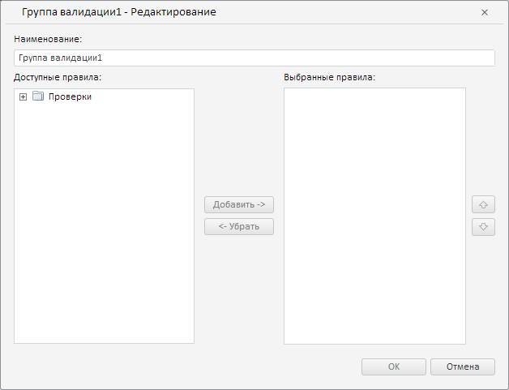

# ValidationRulesPanel.getValidationGroupSettingsDialog

ValidationRulesPanel.getValidationGroupSettingsDialog
-

**

# ValidationRulesPanel.getValidationGroupSettingsDialog

## Синтаксис

getValidationGroupSettingsDialog();

## Описание

Метод getValidationGroupSettingsDialog** возвращает диалог с настройками группы правил валидации.

## Комментарии

Метод возвращает значение типа [PP.TS.Ui.ValidationGroupSettingsDialog](../ValidationGroupSettingsDialog/ValidationGroupSettingsDialog.htm).

## Пример

Для выполнения примера необходимо наличие экземпляра класса [ValidationRulesPanel](ValidationRulesPanel.htm) с наименованием «validationRulesPanel» (см. «[Конструктор ValidationRulesPanel](Constructor_ValidationRulesPanel.htm)»). Отобразим диалог с настройками группы правил валидации:

// Получим диалог настроек группы правил валидации
var validationGroupSettingsDialog = validationRulesPanel.getValidationGroupSettingsDialog();
// Установим заголовок для диалога
validationGroupSettingsDialog.setCaption("Группа валидации1 - Редактирование");
// Зададим наименование группы валидации
validationGroupSettingsDialog._NameTextBox.setValue("Группа валидации1");
// Отобразим данный диалог
validationGroupSettingsDialog.show();

В результате выполнения примера в рабочей книге был показан диалог с настройками группы правил валидации:

См. также:

[ValidationRulesPanel](ValidationRulesPanel.htm)

		Справочная
		 система на версию 10.9
		 от 18/08/2025,
		 © ООО «ФОРСАЙТ»,
