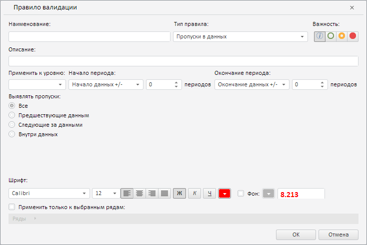

# ValidationRulesPanel.getValidationSettingsDialog

ValidationRulesPanel.getValidationSettingsDialog
-

**

# ValidationRulesPanel.getValidationSettingsDialog

## Синтаксис

getValidationSettingsDialog(state: Object);

## Параметры

state. Настройки правила валидации. Необязательный параметр. Если данный параметр не указан, то по умолчанию в диалоге загружаются значения настроек по умолчанию.

## Описание

Метод getValidationSettingsDialog** возвращает диалог с настройками правила валидации.

## Комментарии

Метод возвращает объект типа [PP.TS.Ui.ValidationSettingsDialog](../ValidationSettingsDialog/ValidationSettingsDialog.htm).

## Пример

Для выполнения примера необходимо наличие экземпляра класса [ValidationRulesPanel](ValidationRulesPanel.htm) с наименованием «validationRulesPanel» (см. «[Конструктор ValidationRulesPanel](Constructor_ValidationRulesPanel.htm)»). Отобразим диалог с настройками правила валидации:

// Получим диалог настроек валидации
var settingsDialog = validationRulesPanel.getValidationSettingsDialog();
// Отобразим данный диалог
settingsDialog.show();

В результате выполнения примера в рабочей книге был показан диалог с настройками правила валидации:

См. также:

[ValidationRulesPanel](ValidationRulesPanel.htm)

		Справочная
		 система на версию 10.9
		 от 18/08/2025,
		 © ООО «ФОРСАЙТ»,
