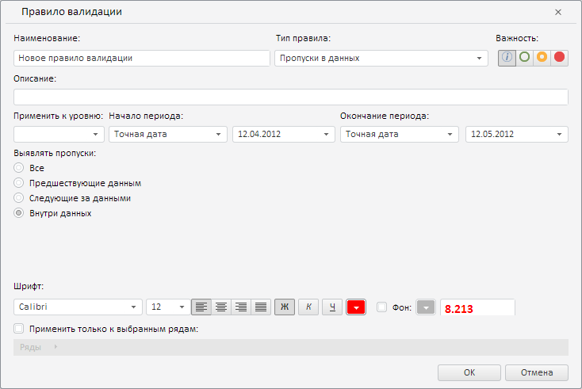

# ValidationRulesPanel.setValidation

ValidationRulesPanel.setValidation
-

**

# ValidationRulesPanel.setValidation

## Синтаксис

setValidation(state: Object, validId: String, cls:
 PP.Mb.MetabaseObjectClass, newValidation: Boolean);

## Параметры

state. Настройки правила валидации;

validId. Ключ моникёра правила
 валидации;

cls. Класс объекта в метабазе;

newValidation. Признак того,
 производится ли валидация в первый раз. Если данная валидация проводится
 впервые, то параметр должен иметь значение true,
 иначе - false.

## Описание

Метод setValidation** устанавливает
 настройки правила валидации в рабочей книге.

## Комментарии

После выполнения метода в рабочей книге отображается диалог с настройками
 правила валидации.

## Пример

Для выполнения примера необходимо наличие экземпляра класса [ValidationRulesPanel](ValidationRulesPanel.htm)
 с наименованием «validationRulesPanel» (см. «[Конструктор
 ValidationRulesPanel](Constructor_ValidationRulesPanel.htm)»). Обработаем событие RequstMetadata,
 установим тип правила валидации «Пропуски данных» с выявлением пропусков
 внутри данных, а также точные даты начала и окончания периода данных для
 валидации:

// Обработаем событие RequestMetadata
validationRulesPanel.RequestMetadata.add(function (sender, args) {
    console.log("Запрос метаданных...");
});
var state = {
    "obInst": {
        "obDesc": {
            // Определим наименование правила
            "n": "Новое правило валидации",
        }
    },
    "details": {
        "missingData": {
            // Выполнять пропуски будем внутри данных
            "type": PP.TS.ValidationMissingDataType.InData
        }
    },
    // Установим тип правила «Пропуски в данных»
    "kind": "MissingData",
    // В качестве начала периода укажем точную дату
    "startDateSettings": {
        "DateOptions": PP.TS.ValidationDateOptions.SpecificDate,
        "date": "2012-04-12", // Дата начала периода
        "lag": 2
    },
    // В качестве окончания периода укажем точную дату
    "endDateSettings": {
        "DateOptions": PP.TS.ValidationDateOptions.SpecificDate,
        "date": "2012-05-12", // Дата окончания периода
        "lag": 3
    }
};
// Определим класс объекта фильтрации в метабазе
var cls = PP.Mb.MetabaseObjectClass.KE_CLASS_VALIDATIONFILTER;
// Укажем настройки правил валидации
validationRulesPanel.setValidation(state, "dfdff434!12", cls, false);

В результате выполнения примера в рабочей книге был отображён диалог
 «Правило валидации». Данное правило имеет тип «Пропуски данных» с выявлением
 пропусков внутри самих данных и период проверки с точной датой начала
 12.04.2012 и точной датой окончания 12.05.2012:

При наступлении события RequestMetadata
 в консоли браузера было выведено соответствующее уведомление:

Запрос метаданных...

См. также:

[ValidationRulesPanel](ValidationRulesPanel.htm)

		Справочная
		 система на версию 10.9
		 от 18/08/2025,
		 © ООО «ФОРСАЙТ»,
