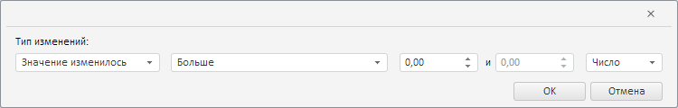

# ValidationSettingsDialog.getComponentMismatchWizard

ValidationSettingsDialog.getComponentMismatchWizard
-

**

# ValidationSettingsDialog.getComponentMismatchWizard

## Синтаксис

getComponentMismatchWizard();

## Описание

Метод getComponentMismatchWizard** возвращает [мастер для выделения изменённых значений данных временных рядов](../../../Components/TimeSeries/ComponentMismatchWizard/ComponentMismatchWizard.htm).

## Комментарии

Метод возвращает объект типа [PP.TS.Ui.ComponentMismatchWizard](../ComponentMismatchWizard/ComponentMismatchWizard.htm).

## Пример

Для выполнения примера необходимо наличие компонента [ValidationSettingsDialog](../../../Components/TimeSeries/ValidationSettingsDialog/ValidationSettingsDialog.htm) с наименованием «validationSettingsDialog» (см. «[Пример создания компонента ValidationSettingsDialog](../../../Components/TimeSeries/ValidationSettingsDialog/ValidationSettingsDialog_Example.htm)»). Отобразим мастер для выделения изменённых значений данных временных рядов в отдельном диалоге:

// Получим мастер для выделения изменённых значений данных временных рядов
var mismatchWizard = validationSettingsDialog.getComponentMismatchWizard();
// Получим DOM-дерево для данного мастера
var dom = mismatchWizard.getDomNode();
// Установим стиль для мастера
PP.addClass(dom, "PPValidationSettingsDlgContent");
// Сделаем мастер видимым
mismatchWizard.show();
// Добавим полученный мастер в стандартный диалог
var dialog = new PP.Ui.Dialog({
    Content: mismatchWizard,
    Width: 750, // Ширина диалога
    Height: 120 // Высота диалога
});
// Отобразим данный диалог
dialog.show();

В результате выполнения примера в созданном диалоге был отображён мастер для выделения изменённых значений данных временных рядов:

См. также:

[ValidationSettingsDialog](ValidationSettingsDialog.htm)

		Справочная
		 система на версию 10.9
		 от 18/08/2025,
		 © ООО «ФОРСАЙТ»,
