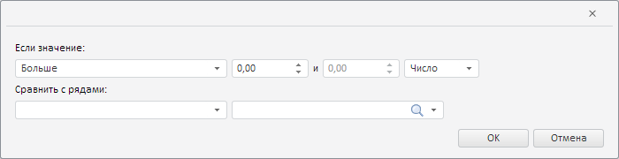

# ValidationSettingsDialog.getCorrelationWizard

ValidationSettingsDialog.getCorrelationWizard
-

**

# ValidationSettingsDialog.getCorrelationWizard

## Синтаксис

getCorrelationWizard();

## Описание

Метод getCorrelationWizard** возвращает мастер для валидации данных путём анализа их корреляционной зависимости.

## Комментарии

Метод возвращает значение типа [PP.TS.Ui.RatioWizard](../RatioWizard/RatioWizard.htm).

## Пример

Для выполнения примера необходимо наличие компонента [ValidationSettingsDialog](../../../Components/TimeSeries/ValidationSettingsDialog/ValidationSettingsDialog.htm) с наименованием «validationSettingsDialog» (см. «[Пример создания компонента ValidationSettingsDialog](../../../Components/TimeSeries/ValidationSettingsDialog/ValidationSettingsDialog_Example.htm)»). Отобразим мастер для валидации данных путём анализа их корреляционной зависимости в отдельном диалоге:

// Получим мастер для валидации данных путём анализа их корреляционной зависимости
var correlationWizard = validationSettingsDialog.getCorrelationWizard();
// Получим DOM-дерево для данного мастера
var dom = correlationWizard.getDomNode();
// Установим стиль для мастера
PP.addClass(dom, "PPValidationSettingsDlgContent");
// Сделаем мастер видимым
correlationWizard.show();
// Добавим полученный мастер в стандартный диалог
var dialog = new PP.Ui.Dialog({
    Content: correlationWizard,
    Width: 700, // Ширина диалога
    Height: 180 // Высота диалога
});
// Отобразим данный диалог
dialog.show();

В результате выполнения примера в созданном диалоге был отображён мастер для валидации данных путём анализа их корреляционной зависимости:

См. также:

[ValidationSettingsDialog](ValidationSettingsDialog.htm)

		Справочная
		 система на версию 10.9
		 от 18/08/2025,
		 © ООО «ФОРСАЙТ»,
