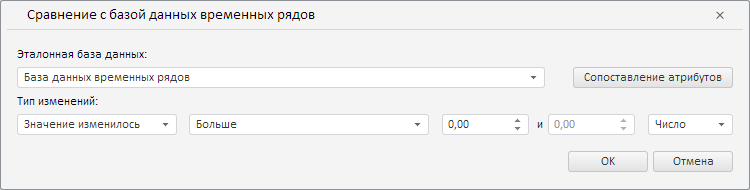

# ValidationSettingsDialog.getCrossDatabaseWizard

ValidationSettingsDialog.getCrossDatabaseWizard
-

**

# ValidationSettingsDialog.getCrossDatabaseWizard

## Синтаксис

getCrossDatabaseWizard();

## Описание

Метод getCrossDatabaseWizard** возвращает мастер правила валидации данных путём их сравнения с базой данных временных рядов.

## Комментарии

Метод возвращает объект типа [PP.TS.Ui.CrossDatabaseWizard](../CrossDatabaseWizard/CrossDatabaseWizard.htm).

## Пример

Для выполнения примера необходимо наличие компонента [ValidationSettingsDialog](../../../Components/TimeSeries/ValidationSettingsDialog/ValidationSettingsDialog.htm) с наименованием «validationSettingsDialog» (см. «[Пример создания компонента ValidationSettingsDialog](../../../Components/TimeSeries/ValidationSettingsDialog/ValidationSettingsDialog_Example.htm)»). Отобразим мастер правила валидации данных путём их сравнения с базой данных временных рядов в отдельном диалоге:

// Получим мастер для валидации данных путём сравнения с базой данных временных рядов
var crossDatabaseWizard = validationSettingsDialog.getCrossDatabaseWizard();
// Сделаем мастер видимым
crossDatabaseWizard.show();
// Получим DOM-дерево для данного мастера
var dom = crossDatabaseWizard.getDomNode();
// Установим стиль для мастера
PP.addClass(dom, "PPValidationSettingsDlgContent");
// Добавим полученный мастер в стандартный диалог
var dialog = new PP.Ui.Dialog({
    Content: crossDatabaseWizard,
    Caption: "Сравнение с базой данных временных рядов", // Заголовок
    Width: 750, // Ширина диалога
    Height: 190 // Высота диалога
});
// Отобразим данный диалог
dialog.show();

В результате выполнения примера в созданном диалоге был отображён мастер правила валидации данных путём их сравнения с базой данных временных рядов:

См. также:

[ValidationSettingsDialog](ValidationSettingsDialog.htm)

		Справочная
		 система на версию 10.9
		 от 18/08/2025,
		 © ООО «ФОРСАЙТ»,
