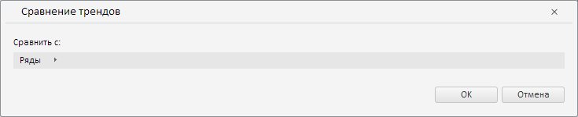

# ValidationSettingsDialog.getTrendWizard

ValidationSettingsDialog.getTrendWizard
-

**

# ValidationSettingsDialog.getTrendWizard

## Синтаксис

getTrendWizard();

## Описание

Метод getTrendWizard** возвращает мастер для валидации данных путём сравнения трендов временных рядов.

## Комментарии

Метод возвращает объект типа [PP.TS.Ui.TrendWizard](../TrendWizard/TrendWizard.htm).

## Пример

Для выполнения примера необходимо наличие компонента [ValidationSettingsDialog](../../../Components/TimeSeries/ValidationSettingsDialog/ValidationSettingsDialog.htm) с наименованием «validationSettingsDialog» (см. «[Пример создания компонента ValidationSettingsDialog](../../../Components/TimeSeries/ValidationSettingsDialog/ValidationSettingsDialog_Example.htm)»). Отобразим мастер для валидации данных путём сравнения трендов временных рядов:

/* Получим мастер для валидации путём сравнения трендов временных рядов */
var trendWizard = validationSettingsDialog.getTrendWizard();
// Получим DOM-дерево для данного мастера
var dom = trendWizard.getDomNode();
// Установим стиль для мастера
PP.addClass(dom, "PPValidationSettingsDlgContent");
// Сделаем мастер видимым
trendWizard.show();
// Добавим полученный мастер в диалог
var dialog = new PP.Ui.Dialog({
    Caption: "Сравнение трендов", // Заголовок диалога
    Content: trendWizard,
    Width: 735, // Ширина диалога
    Height: 150 // Высота диалога
});
// Отобразим данный диалог
dialog.show();
// Получим у мастера цепочку навигации по объектам
var breadcrumb = trendWizard._Breadcrumb;
/* Скроем и вновь отобразим цепочку навигации
   для её корректного отображения */
breadcrumb.hide();
breadcrumb.show();

В результате выполнения примера в созданном диалоге был отображён мастер для валидации путём сравнения трендов временных рядов:

См. также:

[ValidationSettingsDialog](ValidationSettingsDialog.htm)

		Справочная
		 система на версию 10.9
		 от 18/08/2025,
		 © ООО «ФОРСАЙТ»,
