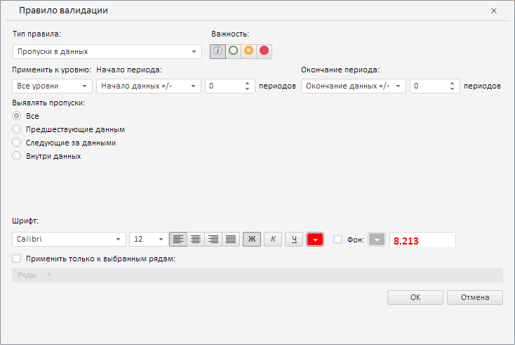

# ValidationSettingsDialog.setMode

ValidationSettingsDialog.setMode
-

**

# ValidationSettingsDialog.setMode

## Синтаксис

setMode(mode: [PP.TS.Ui.ValidationSettingsDialogMode](../../../Enums/ValidationSettingsDialogMode.htm));

## Описание

Метод setMode** устанавливает режим отображения диалога для редактирования правила валидации данных в рабочей книге.

## Комментарии

При упрощённом режиме отображения данного диалога скрываются поля «Наименование» и «Описание».

## Пример

Для выполнения примера необходимо наличие компонента [ValidationSettingsDialog](../../../Components/TimeSeries/ValidationSettingsDialog/ValidationSettingsDialog.htm) с наименованием «validationSettingsDialog» (см. «[Пример создания компонента ValidationSettingsDialog](../../../Components/TimeSeries/ValidationSettingsDialog/ValidationSettingsDialog_Example.htm)»). Отобразим диалог для редактирования правила валидации данных в сокращённом режиме:

// Определим упрощённый режим отображения диалога
var mode = PP.TS.Ui.ValidationSettingsDialogMode.Short;
// Установим данный режим
validationSettingsDialog.setMode(mode);

В результате выполнения примера рассматриваемый диалог был отображён в сокращённом виде:

См. также:

[ValidationSettingsDialog](ValidationSettingsDialog.htm)

		Справочная
		 система на версию 10.9
		 от 18/08/2025,
		 © ООО «ФОРСАЙТ»,
