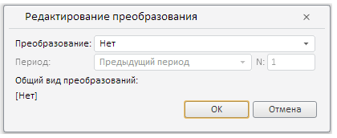

# Конструктор ViewAsDialog

Конструктор ViewAsDialog
-

# Конструктор ViewAsDialog

## Синтаксис

PP.TS.Ui.ViewAsDialog (settings);

## Параметры

settings. JSON-объект со значениями
 свойств компонента.

## Описание

Конструктор ViewAsDialog создает
 экземпляр класса [ViewAsDialog](ViewAsDialog.htm).

## Пример

Для выполнения примера в теге HEAD html-страницы укажите ссылки на следующие
 js- и css-файлы:

	- PP.css;

	- PP.Express.css;

	- PP.TS.css;

	- PP.Metabase.css;

	- PP.js;

	- PP.Metabase.js;

	- PP.Express.js;

	- PP.TS.js.

В теге <body> в качестве значения атрибута «onLoad» указываем
 имя функции, которая выполняется после окончания загрузки тела страницы:

<body onselectstart="return false" class="PPNoSelect" style="margin: 0px">
	<input type="button" value="view as" onclick="openDialog();" />
</body>

В конце документа вставляем код, устанавливающий стили к вершине
 «document.body», соответствующие операционной системе клиента:

В теле html-страницы добавьте следующий скрипт:

После выполнения примера на html-странице будет размещена кнопка «view
 as», при нажатии на которую появится следующее окно:

Также в консоль браузера будет выведено соответствующее сообщение.

См. также:

[ViewAsDialog](ViewAsDialog.htm)

		Справочная
		 система на версию 10.9
		 от 18/08/2025,
		 © ООО «ФОРСАЙТ»,
