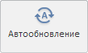

# ViewCatView.getAutoUpdateButton

ViewCatView.getAutoUpdateButton
-

# ViewCatView.getAutoUpdateButton

## Синтаксис

getAutoUpdateButton();

## Описание

Метод getAutoUpdateButton возвращает кнопку «Обновлять автоматически».

## Комментарии

Метод возвращает объект типа PP.Ui.[RibbonButton](dhtmlRibbon.chm::/Classes/RibbonButton/RibbonButton.htm).

## Пример

Для выполнения примера необходимо наличие на html-странице компонента [WorkbookBox](../../../Components/TimeSeries/WorkbookBox/WorkbookBox.htm) с наименованием «workbookBox» (см. «[Пример создания компонента WorkbookBox](../../../Components/TimeSeries/WorkbookBox/Component_WorkbookBox.htm)»). Переименуем кнопку «Обновлять автоматически» и обновим вкладку «Вид», на которой она расположена:

// Получим ленту инструментов
var ribbon = workbookBox.getRibbonView();
// Получим вкладку «Вид»
var viewCatView = ribbon.getViewCategory();
// Получим кнопку «Обновлять автоматически»
var autoUpdateButton = viewCatView.getAutoUpdateButton();
// Определим новое название для кнопки
autoUpdateButton.setContent("Автообновление");
// Обновим вкладку «Вид»
viewCatView.refresh();

В результате выполнения примера кнопка «Обновлять автоматически», расположенная на вкладке «Вид» ленты инструментов рабочей книги, была переименована в «Автообновление»:

См. также:

[ViewCatView](ViewCatView.htm)

		Справочная
		 система на версию 10.9
		 от 18/08/2025,
		 © ООО «ФОРСАЙТ»,
