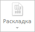

# ViewCatView.getLayoutButton

ViewCatView.getLayoutButton
-

# ViewCatView.getLayoutButton

## Синтаксис

getLayoutButton();

## Описание

Метод getLayoutButton возвращает кнопку «Раскладка».

## Комментарии

Метод возвращает объект типа PP.Ui.[RibbonButton](dhtmlRibbon.chm::/Classes/RibbonButton/RibbonButton.htm).

## Пример

Для выполнения примера необходимо наличие на html-странице компонента [WorkbookBox](../../../Components/TimeSeries/WorkbookBox/WorkbookBox.htm) с наименованием «workbookBox» (см. «[Пример создания компонента WorkbookBox](../../../Components/TimeSeries/WorkbookBox/Component_WorkbookBox.htm)»). Заблокируем кнопку «Раскладка»:

// Получим ленту инструментов
var ribbon = workbookBox.getRibbonView();
// Получим вкладку «Вид»
var viewCatView = ribbon.getViewCategory();
// Получим кнопку «Раскладка»
var layoutButton = viewCatView.getLayoutButton();
// Заблокируем кнопку
layoutButton.setEnabled(false);

В результате выполнения примера кнопка «Раскладка», расположенная на вкладке «Вид» ленты инструментов рабочей книги, была заблокирована:

См. также:

[ViewCatView](ViewCatView.htm)

		Справочная
		 система на версию 10.9
		 от 18/08/2025,
		 © ООО «ФОРСАЙТ»,
