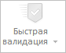

# WbkCategoryView.getAdhocValidationButton

WbkCategoryView.getAdhocValidationButton
-

**

# WbkCategoryView.getAdhocValidationButton

## Синтаксис

getAdhocValidationButton();

## Описание

Метод getAdhocValidationButton**
 возвращает кнопку «Быстрая валидация» на [ленте
 инструментов](../../../Components/TimeSeries/WbkRibbon/WbkRibbon.htm) рабочей книги.

## Комментарии

Метод возвращает значение типа [PP.Ui.SplitButton](dhtmlUi.chm::/Classes/SplitButton/SplitButton.htm).

## Пример

Для выполнения примера необходимо наличие на html-странице компонента
 [WorkbookBox](../../../Components/TimeSeries/WorkbookBox/WorkbookBox.htm)
 с наименованием «workbookBox» (см. «[Пример
 создания компонента WorkbookBox](../../../Components/TimeSeries/WorkbookBox/Component_WorkbookBox.htm)»). Сделаем кнопку «Быстрая валидация»
 неактивной:

// Получим ленту инструментов
var ribbon = workbookBox.getRibbonView();
// Получим категорию «Главная» ленты инструментов
var dataCategory = ribbon.getDataCategory();
// Получим кнопку «Быстрая валидация»
var adhocValidationButton = dataCategory.getAdhocValidationButton();
// Сделаем кнопку неактивной
adhocValidationButton.setEnabled(false);

В результате выполнения примера кнопка «Быстрая валидация» стала неактивной:

См. также:

[WbkCategoryView](WbkCategoryView.htm)

		Справочная
		 система на версию 10.9
		 от 18/08/2025,
		 © ООО «ФОРСАЙТ»,
