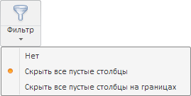

# WbkCategoryView.getFilterButton

WbkCategoryView.getFilterButton
-

# WbkCategoryView.getFilterButton

## Синтаксис

getFilterButton();

## Описание

Метод getFilterButton возвращает
 кнопку «Фильтр» на [ленте
 инструментов](../../../Components/TimeSeries/WbkRibbon/WbkRibbon.htm) рабочей книги.

## Комментарии

Метод возвращает значение типа [PP.Ui.SplitButton](dhtmlUi.chm::/Classes/SplitButton/SplitButton.htm).

## Пример

Для выполнения примера необходимо наличие на html-странице компонента
 [WorkbookBox](../../../Components/TimeSeries/WorkbookBox/WorkbookBox.htm)
 с наименованием «workbookBox» (см. «[Пример
 создания компонента WorkbookBox](../../../Components/TimeSeries/WorkbookBox/Component_WorkbookBox.htm)»). Выберем для кнопки «Фильтр», расположенной
 на ленте инструментов рабочей книги, пункт меню «Скрыть все пустые столбцы»:

// Получим ленту инструментов
var ribbon = workbookBox.getRibbonView();
// Получим категорию «Главная» ленты инструментов
var mainCategory = ribbon.getMainCategory();
// Получим кнопку «Фильтр»
var filterButton = mainCategory.getFilterButton();
// Получим меню данной кнопки
var menu = filterButton.getMenu();
// Получим пункт меню «Скрыть все пустые кнопки»
var hideEmptyColumnsItem = menu.getItems()[1];
// Определим настройки данного пункта меню
var state = mainCategory.getFilterButtonState(hideEmptyColumnsItem, filterButton);
if (!state.suppressEmpty & state.suppressEmptyArea != PP.TS.Ui.FilterEnum.FullSerie) {
    // Выберем пункт меню «Скрыть все пустые кнопки»
    hideEmptyColumnsItem.setChecked(true);
    // Отобразим кнопку нажатой
    filterButton.setIsPressed(true);
} else {
    // Обновим кнопку «Фильтр»
    mainCategory.refreshFilterButton();
}
// Отобразим меню данной кнопки в нужной позиции
var offset = filterButton.getOffset();
menu.show();
menu.setCoords(offset.X, offset.Y + filterButton.getHeight());

В результате выполнения примера для кнопки «Фильтр» был выбран пункт
 меню «Скрыть все пустые столбцы»:

См. также:

[WbkCategoryView](WbkCategoryView.htm)

		Справочная
		 система на версию 10.9
		 от 18/08/2025,
		 © ООО «ФОРСАЙТ»,
