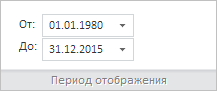

# WbkCategoryView.getPeriodStartDataPicker

WbkCategoryView.getPeriodStartDataPicker
-

# WbkCategoryView.getPeriodStartDataPicker

## Синтаксис

getPeriodStartDataPicker();

## Описание

Метод getPeriodStartDataPicker возвращает
 [редактор
 для ввода даты и времени](dhtmlUi.chm::/Components/DateTimePicker/DateTimePicker.htm) начала периода отображения временных рядов.

## Комментарии

Метод возвращает значение типа [PP.Ui.DateTimePicker](dhtmlUi.chm::/Components/DateTimePicker/DateTimePicker.htm).

## Пример

Для выполнения примера необходимо наличие на html-странице компонента
 [WorkbookBox](../../../Components/TimeSeries/WorkbookBox/WorkbookBox.htm)
 с наименованием «workbookBox» (см. «[Пример
 создания компонента WorkbookBox](../../../Components/TimeSeries/WorkbookBox/Component_WorkbookBox.htm)»). Укажем новый период отображения
 временных рядов, а также изменим надписи к редакторам ввода даты начала
 и конца периода отображения рядов:

// Получим ленту инструментов
var ribbon = workbookBox.getRibbonView();
// Получим категорию «Главная» ленты инструментов
var mainCategory = ribbon.getMainCategory();
// Получим редакторы для ввода начальной и конечной даты в разделе «Период отображения»
var startDataPicker = mainCategory.getPeriodStartDataPicker();
var endDataPicker = mainCategory.getPeriodEndDataPicker();
// Установим новые даты начала и конца периода отображения временных рядов
startDataPicker.setValue(new Date(1999, 0, 01));
endDataPicker.setValue(new Date(2012, 11, 31));
// Получим надписи к редакторам ввода начальной и конечной даты периода отображения рядов
var startLabel = mainCategory.getPeriodStartLabel();
var endLabel = mainCategory.getPeriodEndLabel();
// Изменим текст данных надписей
startLabel.setContent("От:");
endLabel.setContent("До:");

В результате выполнения примера был установлен период отображения временных
 рядов от 01.01.1999 до 31.12.2012, а подписи к редакторам ввода даты «Начало:»
 и «Окончание:» были заменены на «От:» и «До:» соответственно:

Теперь обновим панель «Период отображения» на ленте инструментов рабочей
 книги:

mainCategory.refreshPeriodPanel();

После выполнения указанной строки сценария в соответствующих редакторах
 для ввода даты и времени будут отображаться первая и последняя даты, доступные
 в текущем источнике данных:

См. также:

[WbkCategoryView](WbkCategoryView.htm)

		Справочная
		 система на версию 10.9
		 от 18/08/2025,
		 © ООО «ФОРСАЙТ»,
