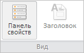

# WbkCategoryView.getPropPanelButton

WbkCategoryView.getPropPanelButton
-

# WbkCategoryView.getPropPanelButton

## Синтаксис

getPropPanelButton();

## Описание

Метод getPropPanelButton возвращает кнопку «Боковая панель» на ленте инструментов рабочей книги.

## Комментарии

Метод возвращает значение типа [PP.Ui.RibbonButton](dhtmlRibbon.chm::/Classes/RibbonButton/RibbonButton.htm).

## Пример

Для выполнения примера необходимо наличие на html-странице компонента [WorkbookBox](../../../Components/TimeSeries/WorkbookBox/WorkbookBox.htm) с наименованием «workbookBox» (см. «[Пример создания компонента WorkbookBox](../../../Components/TimeSeries/WorkbookBox/Component_WorkbookBox.htm)»). Выполним ряд действий над кнопками в разделе «Вид» ленты инструментов рабочей книги: кнопку «Боковая панель» переименуем, «Дерево рядов» скроем, а кнопку «Заголовок» заблокируем и обновим.

// Получим ленту инструментов
var ribbon = workbookBox.getRibbonView();
// Получим категорию «Главная» ленты инструментов
var mainCategory = ribbon.getMainCategory();
// Получим кнопку «Боковая панель», «Дерево рядов» и «Заголовок»
var propPanelButton = mainCategory.getPropPanelButton();
var dataSourceButton = mainCategory.getDataSourceButton();
var titleButton = mainCategory.getTitleButton();
// Переименуем кнопку «Боковая панель»
propPanelButton.setContent("Панель свойств");
// Скроем кнопку «Дерево рядов»
dataSourceButton.hide();
// Заблокируем и обновим кнопку «Заголовок»
titleButton.setEnabled(false);
mainCategory.refreshTitleButton();

В результате выполнения примера кнопка ленты инструментов «Боковая панель» была переименована в «Панель свойств», кнопка «Дерево рядов» была скрыта, а кнопка «Заголовок» - заблокирована и обновлена:

См. также:

[WbkCategoryView](WbkCategoryView.htm)

		Справочная
		 система на версию 10.9
		 от 18/08/2025,
		 © ООО «ФОРСАЙТ»,
