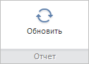

# WbkCategoryView.getRefreshButton

WbkCategoryView.getRefreshButton
-

# WbkCategoryView.getRefreshButton

## Синтаксис

getRefreshButton();

## Описание

Метод getRefreshButton возвращает кнопку «Обновить» на ленте инструментов рабочей книги.

## Комментарии

Метод возвращает значение типа [PP.Ui.RibbonButton](dhtmlRibbon.chm::/Classes/RibbonButton/RibbonButton.htm).

## Пример

Для выполнения примера необходимо наличие на html-странице компонента [WorkbookBox](../../../Components/TimeSeries/WorkbookBox/WorkbookBox.htm) с наименованием «workbookBox» (см. «[Пример создания компонента WorkbookBox](../../../Components/TimeSeries/WorkbookBox/Component_WorkbookBox.htm)»). Увеличим ширину кнопки «Обновить» и обновим вкладку «Главная», на которой она расположена:

// Получим ленту инструментов
var ribbon = workbookBox.getRibbonView();
// Получим категорию «Главная» ленты инструментов
var mainCategory = ribbon.getMainCategory();
// Получим кнопку «Обновить»
var refreshButton = mainCategory.getRefreshButton();
// Расширим данную кнопку
refreshButton.setWidth(120);
// Обновим вкладку "Главная" ленты инструментов
mainCategory.refreshAll();

В результате выполнения примера ширина кнопки «Обновить» была увеличена до 120 пикселей:

См. также:

[WbkCategoryView](WbkCategoryView.htm)

		Справочная
		 система на версию 10.9
		 от 18/08/2025,
		 © ООО «ФОРСАЙТ»,
